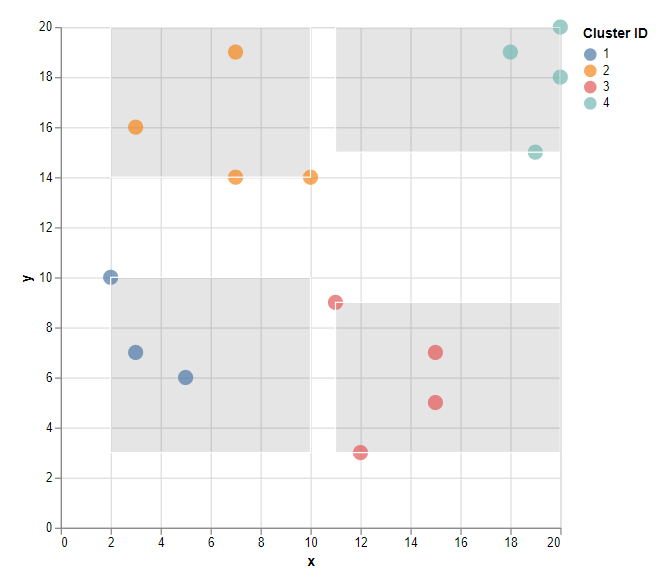
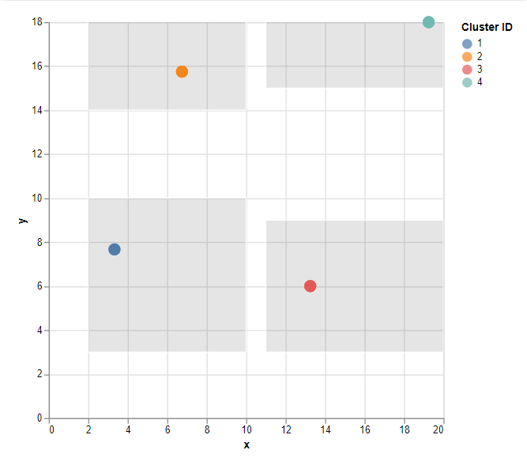
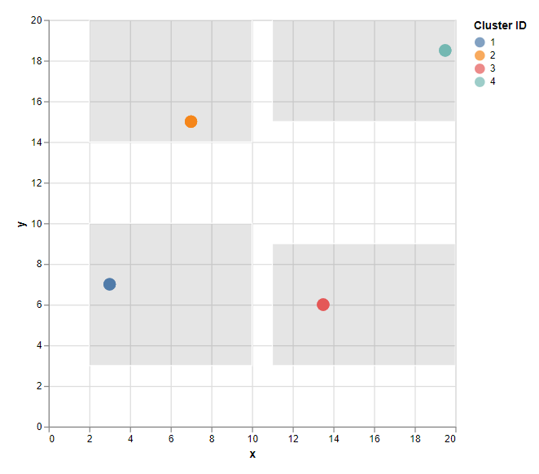

# SIGO

## Examples

Given a distribution of Paris's trees.

```console
 < examples/tree.json  | jq -s '.' |  jp -xy '..[x,y]' -type hist2d -height 20 -width 50
 2.469759│                ·········
         │                ··░░░▓▓··
         │                ·····▒▒··
         │                  ·········        ··▒▒▒
         │··                ···▒▒▒▒▒▒▒▒▒▒··  ··▓▓▓
         │                  ···▒▒▒▒▒▒██░░▒▒▒▒·····
         │  ▒▒▒▒          ··░░░▒▒▒▒░░▒▒▒▒▒▒░░░░
         │  ··░░        ▒▒▒▒▒▒▒░░▒▒▒▒▒▒░░▒▒▒▒▒▒
         │                ▒▒▒▒▒▒▒··▒▒░░····░░░░▒▒▒
         │                ░░▒▒▒▒▒··········▒▒▒▒···
         │                ··░░░▒▒··········▒▒░░
         │            ··▒▒··▒▒▒░░░░▒▒▒▒▒▒░░▒▒░░
         │            ····  ▒▒▒░░░░▒▒▒▒▒▒░░▒▒··
         │                  ···▒▒▒▒░░▒▒▒▒░░··
         │                  ░░░▒▒▒▒▒▒▒▒▒▒··
         │                     ░░▒▒░░······
         │                       ········
         │                         ······
 2.210241└────────────────────────────────────────
         48.74229                         48.91216
```

SIGO generalize the distribution and anomyze it without pertubation.

```console
❯ < examples/tree.json  | sigo |jq -s '.' |  jp -xy '..[x,y]' -type hist2d -height 20 -width 50
10:47AM INF sigo main (commit=c35c2c0a16ca39aa47c3fe87bd21996ee2a811d0 date=2021-12-28 by=youen.peron@cgi.com)
 2.469759│                ·········
         │                ··░░░▓▓··
         │                ·····▒▒··
         │                  ·········        ··▒▒▒
         │··                ···▒▒▒▒▒▒▒▒▒▒··  ··▓▓▓
         │                  ···▒▒▒▒▒▒██░░▒▒▒▒·····
         │  ▒▒▒▒          ··░░░▒▒▒▒░░▒▒▒▒▒▒░░░░
         │  ··░░        ▒▒▒▒▒▒▒░░▒▒▒▒▒▒░░▒▒▒▒▒▒
         │                ▒▒▒▒▒▒▒··▒▒░░····░░░░▒▒▒
         │                ░░▒▒▒▒▒··········▒▒▒▒···
         │                ··░░░▒▒··········▒▒░░
         │            ··▒▒··▒▒▒░░░░▒▒▒▒▒▒░░▒▒░░
         │            ····  ▒▒▒░░░░▒▒▒▒▒▒░░▒▒··
         │                  ···▒▒▒▒░░▒▒▒▒░░··
         │                  ░░░▒▒▒▒▒▒▒▒▒▒··
         │                     ░░▒▒░░······
         │                       ········
         │                         ······
 2.210241└────────────────────────────────────────
         48.74229                         48.91216
```

## Usage

The following flags can be used:

- `--k-value,-k <int>`, allows to choose the value of k for **k-anonymization** (default value is `3`).
- `--l-value,-l <int>`, allows to choose the value of l for **l-diversity** (default value is `1`).
- `--quasi-identifier,-q <strings>`, this flag lists the quasi-identifiers of the dataset.
- `--sensitive,-s <strings>`, this flag lists the sensitive attributes of the dataset.
- `--anonymizer,-a <string>`, allows you to choose the method used for data anonymization (default value is `"NoAnonymizer"`). Choose from the following list [`"general"`, `"meanAggregation"`, `"medianAggregation"`, `"outlier"`, `"laplaceNoise"`, `"gaussianNoise"`].

## DEMO

The `data.json` file contains the following data,

```json
    {"x": 20, "y": 20},
    {"x": 3, "y": 16},
    {"x": 18, "y": 19},
    {"x": 15, "y": 5},
    {"x": 15, "y": 7},
    {"x": 7, "y": 19},
    {"x": 2, "y": 10},
    {"x": 7, "y": 14},
    {"x": 20, "y": 18},
    {"x": 10, "y": 14},
    {"x": 11, "y": 9},
    {"x": 3, "y": 7},
    {"x": 19, "y": 15},
    {"x": 5, "y": 6},
    {"x": 12, "y": 3}
```

### Generalization

- 1st step: cluster data using an id and `NoAnonymizer` method.

```console
< data.json | jq -c '.[]' | sigo -q x,y -i id | jq -s > clusters.json
```

- 2nd step: generalizing the clusters using `general` method.

```console
< data.json | jq -c '.[]' | sigo -q x,y -a general -i id | jq -s > generalization.json
```



### Aggregation

```console
< data.json | jq -c '.[]' | sigo -q x,y -a meanAggregation -i id | jq -s > meanAggregation.json
```



```console
< data.json | jq -c '.[]' | sigo -q x,y -a medianAggregation -i id | jq -s > medianAggregation.json
```


