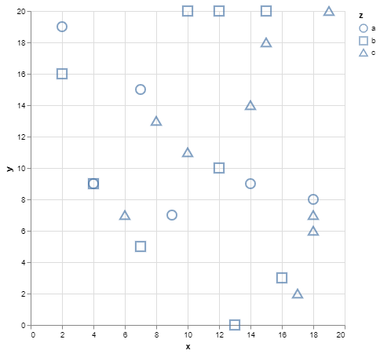
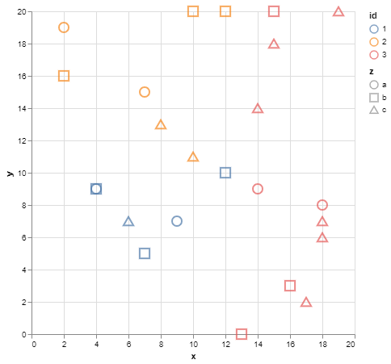

# SIGO

Sigo is a k-anonymity and l-diversity compliant anonymization tool.

## Usage

The following flags can be used:

- `--k-value,-k <int>`, allows to choose the value of k for **k-anonymization** (default value is `3`).
- `--l-value,-l <int>`, allows to choose the value of l for **l-diversity** (default value is `1`).
- `--quasi-identifier,-q <strings>`, this flag lists the quasi-identifiers of the dataset.
- `--sensitive,-s <strings>`, this flag lists the sensitive attributes of the dataset.
- `--anonymizer,-a <string>`, allows to choose the method used for data anonymization (default value is `"NoAnonymizer"`). Choose from the following list [`"general"`, `"meanAggregation"`, `"medianAggregation"`, `"outlier"`, `"laplaceNoise"`, `"gaussianNoise"`, `"swapping"`].
- `--cluster-info,-i <string>`, allows to display information about cluster.
- `--entropy <bool>`, allows to choose if entropy model for l-diversity used.

## DEMO

The `data.json` file contains the following data,

```json
    {"x": 5, "y": 6},
    {"x": 3, "y": 7},
    {"x": 4, "y": 4},
    {"x": 2, "y": 10},
    {"x": 8, "y": 4},
    {"x": 8, "y": 10},
    {"x": 3, "y": 16},
    {"x": 7, "y": 19},
    {"x": 6, "y": 18},
    {"x": 4, "y": 19},
    {"x": 7, "y": 14},
    {"x": 10, "y": 14},
    {"x": 15, "y": 5},
    {"x": 15, "y": 7},
    {"x": 11, "y": 9},
    {"x": 12, "y": 3},
    {"x": 18, "y": 6},
    {"x": 14, "y": 6},
    {"x": 20, "y": 20},
    {"x": 18, "y": 19},
    {"x": 20, "y": 18},
    {"x": 18, "y": 18},
    {"x": 14, "y": 18},
    {"x": 19, "y": 15}
```


### **Step 1:** Generalization

By using the `NoAnonymizer` method and `--cluster-info,i` we can see in which cluster the original data is located.

```console
< data.json | sigo -k 6 -q x,y -i id > clusters.json
```

```json
  {
    "x": 4,
    "y": 4,
    "id": 1
  },
  {
    "x": 8,
    "y": 4,
    "id": 1
  },
```


With the generalization method (`general`) we can see the scope of each cluster.

```console
< data.json | sigo -k 6 -q x,y -a general -i id > generalization.json
```

```json
  {
    "id": 1,
    "x": [2,10],
    "y": [3,10]
  },
  {
    "id": 1,
    "x": [2,10],
    "y": [3,10]
  },
```


### **Step 2:** Anonymization

- Aggregation

```console
< data.json | sigo -k 6 -q x,y -a meanAggregation -i id > aggregation/meanAggregation.json
```

|  |  |
|:---:|:---:|
| Original Data | Anonymized data |

```console
< data.json | sigo -k 6 -q x,y -a medianAggregation -i id > aggregation/medianAggregation.json
```

|  |  |
|:---:|:---:|
| Original Data | Anonymized data |

- Top and Botton Codding

```console
< data.json | sigo -k 6 -q x,y -a outlier -i id > top-bottom-coding/coding.json
```

|  |  |
|:---:|:---:|
| Original Data | Anonymized data |

- Random Noise

```console
< data.json | sigo -k 6 -q x,y -a laplaceNoise -i id > random-noise/laplace.json
```

|  |  |
|:---:|:---:|
| Original Data | Anonymized data |

```console
< data.json | sigo -k 6 -q x,y -a gaussianNoise -i id > random-noise/gaussian.json
```

|  |  |
|:---:|:---:|
| Original Data | Anonymized data |

- Swapping

```console
< data2.json | sigo -k 6 -l 4 -q x,y -s z -a swapping -i id > swapping/swapping.json
```

|  |  |
|:---:|:---:|
| Original Data | Anonymized data |

## l-diversity

In the `examples/demo/l-diveristy` folder is the `data.json` file containing the following data:

```json
    {"x":15, "y":18, "z":"c"},
    {"x":10, "y":20, "z":"b"},
    {"x":6, "y":7, "z":"c"},
    {"x":12, "y":20, "z":"b"},
    {"x":2, "y":19, "z":"a"},
    {"x":18, "y":6, "z":"c"},
    {"x":2, "y":16, "z":"b"},
    {"x":4, "y":9, "z":"a"},
    {"x":18, "y":7, "z":"c"},
    {"x":9, "y":7, "z":"a"},
    {"x":13, "y":0, "z":"b"},
    {"x":17, "y":2, "z":"c"},
    {"x":8, "y":13, "z":"c"},
    {"x":14, "y":14, "z":"c"},
    {"x":12, "y":10, "z":"b"},
    {"x":4, "y":9, "z":"b"},
    {"x":7, "y":5, "z":"b"},
    {"x":18, "y":8, "z":"a"},
    {"x":15, "y":20, "z":"b"},
    {"x":16, "y":3, "z":"b"},
    {"x":10, "y":11, "z":"c"},
    {"x":7, "y":15, "z":"a"},
    {"x":19, "y":20, "z":"c"},
    {"x":14, "y":9, "z":"a"}
```



Assuming attributes x and y are quasi-identifiers and attribute z is sensitive data.
We want our dataset to respect **6-anonymity** and **3-diversity**.

```console
< data.json | sigo -k 6 -l 3 -q x,y -s z -i id > diversity.json
```



## Usage of **PIMO**

**SIGO** considers quasi-identifiers as float numbers. Therefore, QIs of the orignal dataset must all be float number.
However, we can find categories or dates that **SIGO** won't understand.

**PIMO** can be used to transform a string attribute into a sequence of float numbers (it's up to the user to create this sequence).

In the original dataSet, the attribute `Year` is a quasi identifier, but **SIGO** cannot process it.

```json
   {
      "Name":"chevrolet chevelle malibu",
      "Miles_per_Gallon":18,
      "Cylinders":8,
      "Displacement":307,
      "Horsepower":130,
      "Weight_in_lbs":3504,
      "Acceleration":12,
      "Year":"1970-01-01",
      "Origin":"USA"
   }
```

With a simple **`masking.yml`**, we transform this attribute into a sequence of float numbers.

```yml
version: 1
seed: 42
masking:
  - selector:
      jsonpath: "Year"
    mask:
      dateParser:
        inputFormat: "2006-01-02"
        outputFormat: "2006"
  - selector:
      jsonpath: "Year"
    mask:
      fromjson: "Year"

```

DataSet after sequencing:

```json
   {
      "Name":"chevrolet chevelle malibu",
      "Miles_per_Gallon":18,
      "Cylinders":8,
      "Displacement":307,
      "Horsepower":130,
      "Weight_in_lbs":3504,
      "Acceleration":12,
      "Year":1970,
      "Origin":"USA"
   }
```

(After de-identification with **SIGO**, the operation can be undone with another call to **PIMO**. Original values will be saved, using caches for example.)

Dates can be easily transformed into a sequence of floats, but one can imagine categories like colors, origin (if not a sensitive value), or even genders.

## REIDENTIFICATION

With the evolution of information technologies that make it possible to link data from different sources, it is almost impossible to guarantee an anonymization that would offer a zero risk of re-identification.

**Re-identification Definition :** A process (or algorithm) that takes an anonymized dataset and related knowledge as input and seeks to match the anonymized data with real-world individuals.

Let's take as an example a very simple dataset that you can find in the `original.json` file in `examples/re-identification`.

```json
{"id": 1, "x": 5, "y": 6, "z":"a"}
{"id": 2, "x": 3, "y": 7, "z":"a"}
{"id": 3, "x": 4, "y": 4, "z":"c"}
{"id": 4, "x": 2, "y": 10, "z":"b"}
{"id": 5, "x": 8, "y": 4, "z":"a"}
{"id": 6, "x": 8, "y": 10, "z":"a"}
...
```

And suppose that we have 2 quasi-identifiers: `x` and `y` and as sensitive data the variable `z`. Anonymize the dataset using `sigo`, we use sigo's default settings **k=3** and **l=1** with the **meanAggregation** method :

```console
sigo -q x,y -s z -a meanAggregation -i cluster < original.json > anonymized.json
```

```json
{"id":1,"x":7,"y":6.67,"z":"a","cluster":2}
{"id":2,"x":3,"y":7,"z":"a","cluster":1}
{"id":3,"x":3,"y":7,"z":"c","cluster":1}
{"id":4,"x":3,"y":7,"z":"b","cluster":1}
{"id":5,"x":7,"y":6.67,"z":"a","cluster":2}
{"id":6,"x":7,"y":6.67,"z":"a","cluster":2}
...
```

**Objective :** Identify for each individual in the original dataset (data from the open data) whether an anonymized individual is similar to him assuming the worst case scenario, i.e. the attacker has the original dataset but not the sensitive data.

The data that the attacker has is in the `openData.json` file in `examples/re-identification`.

```json
{"id": 1, "x": 5, "y": 6}
{"id": 2, "x": 3, "y": 7}
{"id": 3, "x": 4, "y": 4}
{"id": 4, "x": 2, "y": 10}
{"id": 5, "x": 8, "y": 4}
{"id": 6, "x": 8, "y": 10}
...
```


Our method of re-identification is to find the closest or most similar individuals.

This approach depends greatly on the concepts of distance and similarity (more details in èxample/re-identification/concept).

### Approach

- 1st step:

Merge the anonymized data and the data from the open data, then add a binary attribute *original* which indicates the origin of the individual (`0` if it is the anonymized data and `1` if it is the external data to be re-identified).


The files are located in the folder `examples/re-identification`.

```console
cat anonymized.json openData.json > merged.json
```

``` json
...
{"original":0,"id":22,"x":16.67,"y":18.33,"z":"c"}
{"original":0,"id":23,"x":16.67,"y":18.33,"z":"b"}
{"original":0,"id":24,"x":19.67,"y":17.67,"z":"b"}
{"original":1,"id": 1, "x": 5, "y": 6}
{"original":1,"id": 2, "x": 3, "y": 7}
{"original":1,"id": 3, "x": 4, "y": 4}
...
```

- 2nd step:

Use sigo to form clusters of similar individuals.

```console
sigo -q x,y -s original -k 6 -l 2 -i cluster < merged.json
```

``` json
{"id":2,"original":0,"x":3,"y":7,"z":"a","cluster":1}
{"id":2,"original":1,"x":3,"y":7,"z":null,"cluster":1}
{"id":3,"original":0,"x":3,"y":7,"z":"c","cluster":1}
{"id":3,"original":1,"x":4,"y":4,"z":null,"cluster":1}
{"id":4,"original":1,"x":2,"y":10,"z":null,"cluster":1}
{"id":4,"original":0,"x":3,"y":7,"z":"b","cluster":1}
{"id":1,"original":1,"x":5,"y":6,"z":null,"cluster":2}
{"id":1,"original":0,"x":7,"y":6.67,"z":"a","cluster":2}
{"id":5,"original":0,"x":7,"y":6.67,"z":"a","cluster":2}
{"id":5,"original":1,"x":8,"y":4,"z":null,"cluster":2}
{"id":6,"original":0,"x":7,"y":6.67,"z":"a","cluster":2}
{"id":6,"original":1,"x":8,"y":10,"z":null,"cluster":2}
...
```

- 3rd step:

    - if in a cluster the sensitive data has the same value then we can re-identify the original individuals with this sensitive data.
    - if in a cluster the sensitive data is not the same but the anonymized individuals are the same then we are not able to re-identify the original individuals.
    - if in a cluster the sensitive data is not the same and the anonymized individuals are not the same then a distance computation will be performed to try to re-identify the individuals.


Below is the use of `sigo` for re-identification.

```console
sigo -q x,y -s original -k 6 -l 2 -a reidentification --args z < merged.json
```

```json
{"id":1,"original":1,"x":5,"y":6,"z":"a"}
{"id":1,"original":0,"x":7,"y":6.67,"z":"a"}
{"id":2,"original":0,"x":3,"y":7,"z":"a"}
{"id":2,"original":1,"x":3,"y":7,"z":null}
{"id":3,"original":0,"x":3,"y":7,"z":"c"}
{"id":3,"original":1,"x":4,"y":4,"z":null}
{"id":4,"original":1,"x":2,"y":10,"z":null}
{"id":4,"original":0,"x":3,"y":7,"z":"b"}
{"id":5,"original":0,"x":7,"y":6.67,"z":"a"}
{"id":5,"original":1,"x":8,"y":4,"z":"a"}
{"id":6,"original":0,"x":7,"y":6.67,"z":"a"}
{"id":6,"original":1,"x":8,"y":10,"z":"a"}
{"id":7,"original":1,"x":3,"y":16,"z":"a"}
{"id":7,"original":0,"x":4.33,"y":17.67,"z":"a"}
{"id":8,"original":1,"x":7,"y":19,"z":null}
{"id":8,"original":0,"x":8,"y":15.67,"z":"a"}
{"id":9,"original":0,"x":4.33,"y":17.67,"z":"a"}
{"id":9,"original":1,"x":6,"y":18,"z":"a"}
{"id":10,"original":0,"x":4,"y":18,"z":"b"}
{"id":10,"original":1,"x":4,"y":19,"z":"b"}
{"id":11,"original":1,"x":7,"y":14,"z":null}
{"id":11,"original":0,"x":8,"y":15.67,"z":"c"}
{"id":12,"original":0,"x":8,"y":15.67,"z":"c"}
{"id":12,"original":1,"x":10,"y":14,"z":null}
{"id":13,"original":1,"x":15,"y":5,"z":null}
{"id":13,"original":0,"x":16,"y":6,"z":"c"}
{"id":14,"original":1,"x":15,"y":7,"z":null}
{"id":14,"original":0,"x":16,"y":6,"z":"b"}
{"id":15,"original":1,"x":11,"y":9,"z":null}
{"id":15,"original":0,"x":12.33,"y":6,"z":"b"}
{"id":16,"original":1,"x":12,"y":3,"z":null}
{"id":16,"original":0,"x":12.33,"y":6,"z":"a"}
{"id":17,"original":0,"x":16,"y":6,"z":"c"}
{"id":17,"original":1,"x":18,"y":6,"z":null}
{"id":18,"original":0,"x":12.33,"y":6,"z":"c"}
{"id":18,"original":1,"x":14,"y":6,"z":null}
{"id":19,"original":0,"x":19.67,"y":17.67,"z":"b"}
{"id":19,"original":1,"x":20,"y":20,"z":"b"}
{"id":20,"original":0,"x":16.67,"y":18.33,"z":"c"}
{"id":20,"original":1,"x":18,"y":19,"z":null}
{"id":21,"original":0,"x":19.67,"y":17.67,"z":"b"}
{"id":21,"original":1,"x":20,"y":18,"z":"b"}
{"id":22,"original":0,"x":16.67,"y":18.33,"z":"c"}
{"id":22,"original":1,"x":18,"y":18,"z":null}
{"id":23,"original":1,"x":14,"y":18,"z":null}
{"id":23,"original":0,"x":16.67,"y":18.33,"z":"b"}
{"id":24,"original":1,"x":19,"y":15,"z":"b"}
{"id":24,"original":0,"x":19.67,"y":17.67,"z":"b"}
```

### Usage for sigo reidentification

These flags must be used for re-identification :

- `--quasi-identifier,-q <strings>`, this flag lists the attributes (quasi-identifiers) of datasets.
- `--sensitive,-s original`, this flag tells sigo to make the difference between anonymized data and original data to be re-identified.
- `--l-value,-l 2`, the l-diversity parameter is set to 2 to have at least one anonymized data and one original data in the same cluster.
- `--anonymizer,-a reidentification`, this flag allows to run the re-identification.
- `--args <strings>`, this flag lists the arguments to pass to the re-identification method, i.e. the list of sensitive attributes of the dataset.

The other `sigo` flags can be used in addition.

## Contributors

- CGI France ✉[Contact support](mailto:LINO.fr@cgi.com)

## License

Copyright (C) 2022 CGI France

PIMO is free software: you can redistribute it and/or modify
it under the terms of the GNU General Public License as published by
the Free Software Foundation, either version 3 of the License, or
(at your option) any later version.

PIMO is distributed in the hope that it will be useful,
but WITHOUT ANY WARRANTY; without even the implied warranty of
MERCHANTABILITY or FITNESS FOR A PARTICULAR PURPOSE.  See the
GNU General Public License for more details.

You should have received a copy of the GNU General Public License
 along with SIGO.  If not, see <http://www.gnu.org/licenses/>.
