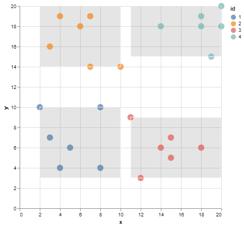

# SIGO

Sigo is a k-anonymity and l-diversity compliant anonymization tool.

## Usage

The following flags can be used:

- `--k-value,-k <int>`, allows to choose the value of k for **k-anonymization** (default value is `3`).
- `--l-value,-l <int>`, allows to choose the value of l for **l-diversity** (default value is `1`).
- `--quasi-identifier,-q <strings>`, this flag lists the quasi-identifiers of the dataset.
- `--sensitive,-s <strings>`, this flag lists the sensitive attributes of the dataset.
- `--anonymizer,-a <string>`, allows to choose the method used for data anonymization (default value is `"NoAnonymizer"`). Choose from the following list [`"general"`, `"meanAggregation"`, `"medianAggregation"`, `"outlier"`, `"laplaceNoise"`, `"gaussianNoise"`].
- `--cluster-info,-i <string>`, allows to display information about cluster.
- `--entropy <bool>`, allows to choose if entropy model for l-diversity used.

## DEMO

The `data.json` file contains the following data,

```json
    {"x": 5, "y": 6},
    {"x": 3, "y": 7},
    {"x": 4, "y": 4},
    {"x": 2, "y": 10},
    {"x": 8, "y": 4},
    {"x": 8, "y": 10},
    {"x": 3, "y": 16},
    {"x": 7, "y": 19},
    {"x": 6, "y": 18},
    {"x": 4, "y": 19},
    {"x": 7, "y": 14},
    {"x": 10, "y": 14},
    {"x": 15, "y": 5},
    {"x": 15, "y": 7},
    {"x": 11, "y": 9},
    {"x": 12, "y": 3},
    {"x": 18, "y": 6},
    {"x": 14, "y": 6},
    {"x": 20, "y": 20},
    {"x": 18, "y": 19},
    {"x": 20, "y": 18},
    {"x": 18, "y": 18},
    {"x": 14, "y": 18},
    {"x": 19, "y": 15}
```


### **Step 1:** Generalization

By using the `NoAnonymizer` method and `--cluster-info,i` we can see in which cluster the original data is located.

```console
< data.json | sigo -k 6 -q x,y -i id > clusters.json
```

```json
  {
    "x": 4,
    "y": 4,
    "id": 1
  },
  {
    "x": 8,
    "y": 4,
    "id": 1
  },
```


With the generalization method (`general`) we can see the scope of each cluster.

```console
< data.json | sigo -k 6 -q x,y -a general -i id > generalization.json
```

```json
  {
    "id": 1,
    "x": [2,10],
    "y": [3,10]
  },
  {
    "id": 1,
    "x": [2,10],
    "y": [3,10]
  },
```



### **Step 2:** Anonymization

- Aggregation

```console
< data.json | sigo -k 6 -q x,y -a meanAggregation -i id > aggregation/meanAggregation.json
```

|  |  |
|:---:|:---:|
| Original Data | Anonymized data |

```console
< data.json | sigo -k 6 -q x,y -a medianAggregation -i id > aggregation/medianAggregation.json
```

|  |  |
|:---:|:---:|
| Original Data | Anonymized data |

- Top and Botton Codding

```console
< data.json | sigo -k 6 -q x,y -a outlier -i id > top-bottom-coding/coding.json
```

|  |  |
|:---:|:---:|
| Original Data | Anonymized data |

- Random Noise

```console
< data.json | sigo -k 6 -q x,y -a laplaceNoise -i id > random-noise/laplace.json
```

|  |  |
|:---:|:---:|
| Original Data | Anonymized data |

```console
< data.json | sigo -k 6 -q x,y -a gaussianNoise -i id > random-noise/gaussian.json
```

|  |  |
|:---:|:---:|
| Original Data | Anonymized data |

## l-diversity

In the `examples/demo/l-diveristy` folder is the `data.json` file containing the following data:

```json
    {"x":15, "y":18, "z":"c"},
    {"x":10, "y":20, "z":"b"},
    {"x":6, "y":7, "z":"c"},
    {"x":12, "y":20, "z":"b"},
    {"x":2, "y":19, "z":"a"},
    {"x":18, "y":6, "z":"c"},
    {"x":2, "y":16, "z":"b"},
    {"x":4, "y":9, "z":"a"},
    {"x":18, "y":7, "z":"c"},
    {"x":9, "y":7, "z":"a"},
    {"x":13, "y":0, "z":"b"},
    {"x":17, "y":2, "z":"c"},
    {"x":8, "y":13, "z":"c"},
    {"x":14, "y":14, "z":"c"},
    {"x":12, "y":10, "z":"b"},
    {"x":4, "y":9, "z":"b"},
    {"x":7, "y":5, "z":"b"},
    {"x":18, "y":8, "z":"a"},
    {"x":15, "y":20, "z":"b"},
    {"x":16, "y":3, "z":"b"},
    {"x":10, "y":11, "z":"c"},
    {"x":7, "y":15, "z":"a"},
    {"x":19, "y":20, "z":"c"},
    {"x":14, "y":9, "z":"a"}
```


Assuming attributes x and y are quasi-identifiers and attribute z is sensitive data.
We want our dataset to respect **6-anonymity** and **3-diversity**.

```console
< data.json | sigo -k 6 -l 3 -q x,y -s z -i id > diversity.json
```


## Usage of **PIMO**

**SIGO** considers quasi-identifiers as float numbers. Therefore, QIs of the orignal dataset must all be float number.
However, we can find categories or dates that **SIGO** won't understand.

**PIMO** can be used to transform a string attribute into a sequence of float numbers (it's up to the user to create this sequence).

In the original dataSet, the attribute `Year` is a quasi identifier, but **SIGO** cannot process it.

```json
   {
      "Name":"chevrolet chevelle malibu",
      "Miles_per_Gallon":18,
      "Cylinders":8,
      "Displacement":307,
      "Horsepower":130,
      "Weight_in_lbs":3504,
      "Acceleration":12,
      "Year":"1970-01-01",
      "Origin":"USA"
   }
```

With a simple **`masking.yml`**, we transform this attribute into a sequence of float numbers.

```yml
version: 1
seed: 42
masking:
  - selector:
      jsonpath: "Year"
    mask:
      dateParser:
        inputFormat: "2006-01-02"
        outputFormat: "2006"
  - selector:
      jsonpath: "Year"
    mask:
      fromjson: "Year"

```

DataSet after sequencing:

```json
   {
      "Name":"chevrolet chevelle malibu",
      "Miles_per_Gallon":18,
      "Cylinders":8,
      "Displacement":307,
      "Horsepower":130,
      "Weight_in_lbs":3504,
      "Acceleration":12,
      "Year":1970,
      "Origin":"USA"
   }
```

(After de-identification with **SIGO**, the operation can be undone with another call to **PIMO**. Original values will be saved, using caches for example.)

Dates can be easily transformed into a sequence of floats, but one can imagine categories like colors, origin (if not a sensitive value), or even genders.

## Contributors

- CGI France ✉[Contact support](mailto:LINO.fr@cgi.com)

## License

Copyright (C) 2022 CGI France

PIMO is free software: you can redistribute it and/or modify
it under the terms of the GNU General Public License as published by
the Free Software Foundation, either version 3 of the License, or
(at your option) any later version.

PIMO is distributed in the hope that it will be useful,
but WITHOUT ANY WARRANTY; without even the implied warranty of
MERCHANTABILITY or FITNESS FOR A PARTICULAR PURPOSE.  See the
GNU General Public License for more details.

You should have received a copy of the GNU General Public License
 along with SIGO.  If not, see <http://www.gnu.org/licenses/>.
