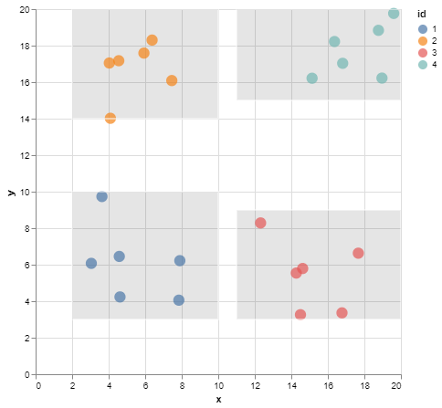
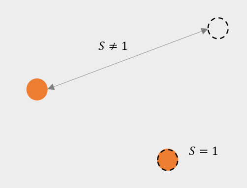

# SIGO

Sigo is a k-anonymity and l-diversity compliant anonymization tool.

## Usage

The following flags can be used:

- `--k-value,-k <int>`, allows to choose the value of k for **k-anonymization** (default value is `3`).
- `--l-value,-l <int>`, allows to choose the value of l for **l-diversity** (default value is `1`).
- `--quasi-identifier,-q <strings>`, this flag lists the quasi-identifiers of the dataset.
- `--sensitive,-s <strings>`, this flag lists the sensitive attributes of the dataset.
- `--anonymizer,-a <string>`, allows to choose the method used for data anonymization (default value is `"NoAnonymizer"`). Choose from the following list [`"general"`, `"meanAggregation"`, `"medianAggregation"`, `"outlier"`, `"laplaceNoise"`, `"gaussianNoise"`, `"swapping"`].
- `--cluster-info,-i <string>`, allows to display information about cluster.
- `--entropy <bool>`, allows to choose if entropy model for l-diversity used.

## DEMO

The `data.json` file contains the following data,

```json
    {"x": 5, "y": 6},
    {"x": 3, "y": 7},
    {"x": 4, "y": 4},
    {"x": 2, "y": 10},
    {"x": 8, "y": 4},
    {"x": 8, "y": 10},
    {"x": 3, "y": 16},
    {"x": 7, "y": 19},
    {"x": 6, "y": 18},
    {"x": 4, "y": 19},
    {"x": 7, "y": 14},
    {"x": 10, "y": 14},
    {"x": 15, "y": 5},
    {"x": 15, "y": 7},
    {"x": 11, "y": 9},
    {"x": 12, "y": 3},
    {"x": 18, "y": 6},
    {"x": 14, "y": 6},
    {"x": 20, "y": 20},
    {"x": 18, "y": 19},
    {"x": 20, "y": 18},
    {"x": 18, "y": 18},
    {"x": 14, "y": 18},
    {"x": 19, "y": 15}
```


### **Step 1:** Generalization

By using the `NoAnonymizer` method and `--cluster-info,i` we can see in which cluster the original data is located.

```console
< data.json | sigo -k 6 -q x,y -i id > clusters.json
```

```json
  {
    "x": 4,
    "y": 4,
    "id": 1
  },
  {
    "x": 8,
    "y": 4,
    "id": 1
  },
```


With the generalization method (`general`) we can see the scope of each cluster.

```console
< data.json | sigo -k 6 -q x,y -a general -i id > generalization.json
```

```json
  {
    "id": 1,
    "x": [2,10],
    "y": [3,10]
  },
  {
    "id": 1,
    "x": [2,10],
    "y": [3,10]
  },
```


### **Step 2:** Anonymization

- Aggregation

```console
< data.json | sigo -k 6 -q x,y -a meanAggregation -i id > aggregation/meanAggregation.json
```

|  |  |
|:---:|:---:|
| Original Data | Anonymized data |

```console
< data.json | sigo -k 6 -q x,y -a medianAggregation -i id > aggregation/medianAggregation.json
```

|  |  |
|:---:|:---:|
| Original Data | Anonymized data |

- Top and Botton Codding

```console
< data.json | sigo -k 6 -q x,y -a outlier -i id > top-bottom-coding/coding.json
```

|  |  |
|:---:|:---:|
| Original Data | Anonymized data |

- Random Noise

```console
< data.json | sigo -k 6 -q x,y -a laplaceNoise -i id > random-noise/laplace.json
```

|  |  |
|:---:|:---:|
| Original Data | Anonymized data |

```console
< data.json | sigo -k 6 -q x,y -a gaussianNoise -i id > random-noise/gaussian.json
```

|  |  |
|:---:|:---:|
| Original Data | Anonymized data |

- Swapping

```console
< data2.json | sigo -k 6 -l 4 -q x,y -s z -a swapping -i id > swapping/swapping.json
```

|  |  |
|:---:|:---:|
| Original Data | Anonymized data |

## l-diversity

In the `examples/demo/l-diveristy` folder is the `data.json` file containing the following data:

```json
    {"x":15, "y":18, "z":"c"},
    {"x":10, "y":20, "z":"b"},
    {"x":6, "y":7, "z":"c"},
    {"x":12, "y":20, "z":"b"},
    {"x":2, "y":19, "z":"a"},
    {"x":18, "y":6, "z":"c"},
    {"x":2, "y":16, "z":"b"},
    {"x":4, "y":9, "z":"a"},
    {"x":18, "y":7, "z":"c"},
    {"x":9, "y":7, "z":"a"},
    {"x":13, "y":0, "z":"b"},
    {"x":17, "y":2, "z":"c"},
    {"x":8, "y":13, "z":"c"},
    {"x":14, "y":14, "z":"c"},
    {"x":12, "y":10, "z":"b"},
    {"x":4, "y":9, "z":"b"},
    {"x":7, "y":5, "z":"b"},
    {"x":18, "y":8, "z":"a"},
    {"x":15, "y":20, "z":"b"},
    {"x":16, "y":3, "z":"b"},
    {"x":10, "y":11, "z":"c"},
    {"x":7, "y":15, "z":"a"},
    {"x":19, "y":20, "z":"c"},
    {"x":14, "y":9, "z":"a"}
```


Assuming attributes x and y are quasi-identifiers and attribute z is sensitive data.
We want our dataset to respect **6-anonymity** and **3-diversity**.

```console
< data.json | sigo -k 6 -l 3 -q x,y -s z -i id > diversity.json
```


## Usage of **PIMO**

**SIGO** considers quasi-identifiers as float numbers. Therefore, QIs of the orignal dataset must all be float number.
However, we can find categories or dates that **SIGO** won't understand.

**PIMO** can be used to transform a string attribute into a sequence of float numbers (it's up to the user to create this sequence).

In the original dataSet, the attribute `Year` is a quasi identifier, but **SIGO** cannot process it.

```json
   {
      "Name":"chevrolet chevelle malibu",
      "Miles_per_Gallon":18,
      "Cylinders":8,
      "Displacement":307,
      "Horsepower":130,
      "Weight_in_lbs":3504,
      "Acceleration":12,
      "Year":"1970-01-01",
      "Origin":"USA"
   }
```

With a simple **`masking.yml`**, we transform this attribute into a sequence of float numbers.

```yml
version: 1
seed: 42
masking:
  - selector:
      jsonpath: "Year"
    mask:
      dateParser:
        inputFormat: "2006-01-02"
        outputFormat: "2006"
  - selector:
      jsonpath: "Year"
    mask:
      fromjson: "Year"

```

DataSet after sequencing:

```json
   {
      "Name":"chevrolet chevelle malibu",
      "Miles_per_Gallon":18,
      "Cylinders":8,
      "Displacement":307,
      "Horsepower":130,
      "Weight_in_lbs":3504,
      "Acceleration":12,
      "Year":1970,
      "Origin":"USA"
   }
```

(After de-identification with **SIGO**, the operation can be undone with another call to **PIMO**. Original values will be saved, using caches for example.)

Dates can be easily transformed into a sequence of floats, but one can imagine categories like colors, origin (if not a sensitive value), or even genders.

## REIDENTIFICATION

With the evolution of information technologies that make it possible to link data from different sources, it is almost impossible to guarantee an anonymization that would offer a zero risk of re-identification.

**Re-identification Definition :** A process (or algorithm) that takes an anonymized dataset and related knowledge as input and seeks to match the anonymized data with real-world individuals.

Let's take as an example a very simple dataset that you can find in the `original.json` file in `examples/re-identification`.

```json
{"x": 5, "y": 6, "z":"a"}
{"x": 3, "y": 7, "z":"a"}
{"x": 4, "y": 4, "z":"c"}
{"x": 2, "y": 10, "z":"b"}
{"x": 8, "y": 4, "z":"a"}
...
```

And suppose that we have 2 quasi-identifiers: `x` and `y` and as sensitive data the variable `z`. Anonymize the dataset using `sigo`, we use sigo's default settings **k=3** and **l=1** with the **meanAggregation** method :

```console
sigo -q x,y -s z -a meanAggregation < original.json > anonymized.json
```

```json
{"x":3,"y":7,"z":"b"}
{"x":3,"y":7,"z":"a"}
{"x":3,"y":7,"z":"c"}
{"x":7,"y":6.67,"z":"a"}
{"x":7,"y":6.67,"z":"a"}
...
```

**Objective :** Identify for each individual in the original dataset (data from the open data) whether an anonymized individual is similar to him assuming the worst case scenario, i.e. the attacker has the original dataset but not the sensitive data.

The data that the attacker has is in the `openData.json` file in `examples/re-identification`.

```json
{"x": 5, "y": 6}
{"x": 3, "y": 7}
{"x": 4, "y": 4}
{"x": 2, "y": 10}
{"x": 8, "y": 4}
...
```


Our method of re-identification is to find the closest or most similar individuals.

This approach depends greatly on the concepts of distance and similarity.

### Key concepts

**Definition of distance :** (*wikipédia*)
We call distance, on a set , any application `d` defined on  and with values in the set of positive or zero real numbers (),

> 

verifying the following properties :

- symmetry : %20%5Cin%20E%5E%7B2%7D,%20d(a,b)%20=%20d(b,a)%20)
- separation : %20%5Cin%20E%5E%7B2%7D,%20d(a,b)%20=%200%20%5CLeftrightarrow%20a%20=%20b%20)
- triangular inequality : %20%5Cin%20E%5E%7B3%7D,%20d(a,c)%20%5Cleq%20d(a,b)%20&plus;%20d(b,c))

The best known distances are the **Euclidean distance** and the **Manhattan distance**.


|%20=%20%5Csqrt%7B%5Csum_%7Bi=1%7D%5E%7Bn%7D%5Cleft%20(%20a_%7Bi%7D%20-%20b_%7Bi%7D%20%5Cright%20)%5E%7B2%7D%7D%20) | %20=%20%5Csum_%7Bi=1%7D%5E%7Bn%7D%20%5Cleft%7C%20a_%7Bi%7D%20-%20b_%7Bi%7D%20%5Cright%7C) |
|:----------------------:|:---------------------:|
| **Euclidean** distance | **Manhattan** distance|


> https://towardsdatascience.com/17-types-of-similarity-and-dissimilarity-measures-used-in-data-science-3eb914d2681

We can use a distance to define a similarity: the more two points are distant, the less similar they are, and inversely. We can then transform a distance `d` into a similarity `s` in the following way :

> Similarity
> 

A similarity index is between 0 and 1 where 0 indicates a total difference between the points and 1 indicates a total similarity.

We have the following properties :




### Approach

The approach is as follows :

- Individuals with the same tuples of quasi-identifiers are grouped together.
- If individuals in a group have the same value of sensitive data :

> ```diff
> - then this sensitive data is given,
> + else it is not given
> ```


- After that, we calculate the similarity between each individual collected from the open data and the filtered individuals of the anonymized dataset.
- If similarity score is higher than the `threshold` set by the user and the sensitive data is found, then the individual can be re-identified.


Below is the use of `sigo` for re-identification with a `threshold` set to **0.6**.

```console
sigo reidentification -q x,y -s z --load-original examples/re-identification/openData.json --load-masked examples/re-identification/anonymized.json --threshold 0.6
```

```json
{"x":5,"y":6,"sensitive":["a"],"similarity":75.36}
{"x":8,"y":4,"sensitive":["a"],"similarity":69.3}
{"x":8,"y":10,"sensitive":["a"],"similarity":60.59}
{"x":20,"y":20,"sensitive":["b"],"similarity":74.69}
{"x":20,"y":18,"sensitive":["b"],"similarity":98.11}
{"x":19,"y":15,"sensitive":["b"],"similarity":65.02}
```

### Usage for sigo reidentification

The following flags can be used:

- `--quasi-identifier,-q <strings>`, this flag lists the attributes (quasi-identifiers) of datasets.
- `--sensitive,-s <strings>`, this flag lists the sensitive attributes of the anonymized dataset.
- `--load-original=openData.json`, allows to load the data collected from the open data `openData.json`.
- `--load-masked=anonymizedData.json`, allows to load the anonymized data `anonymizedData.json` that you want to re-identify.
- `--threshold,-t <float32>`, this flag indicates the level of similarity we want to have for the re-identification between 0 and 1. 1 means that we want to re-identify individuals with a 100% similarity level.

## Contributors

- CGI France ✉[Contact support](mailto:LINO.fr@cgi.com)

## License

Copyright (C) 2022 CGI France

PIMO is free software: you can redistribute it and/or modify
it under the terms of the GNU General Public License as published by
the Free Software Foundation, either version 3 of the License, or
(at your option) any later version.

PIMO is distributed in the hope that it will be useful,
but WITHOUT ANY WARRANTY; without even the implied warranty of
MERCHANTABILITY or FITNESS FOR A PARTICULAR PURPOSE.  See the
GNU General Public License for more details.

You should have received a copy of the GNU General Public License
 along with SIGO.  If not, see <http://www.gnu.org/licenses/>.
