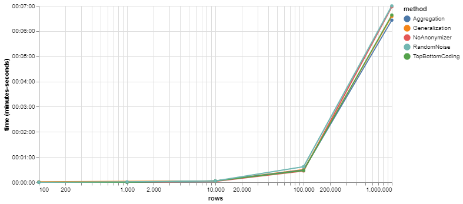
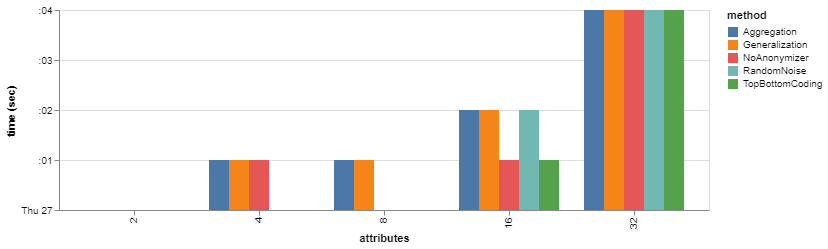

# Boundary Tests on SIGO

This document presents the limitations of sigo regarding the size of the datasets
We will generate different datasets by varying the number of rows and the number of columns.
We will test these parameters on the different anonymization methods.

## Number of rows

We generate a dataset containing 2 attributes of integers and we vary the size of the dataset.

```python
import numpy as np
import pandas as pd

df1 = pd.DataFrame(np.random.randint(0,100,size=(100, 2)), columns=list("AB"))
df1.to_json("test1_1.json", orient = "records")

df2 = pd.DataFrame(np.random.randint(0,1000,size=(1000, 2)), columns=list("AB"))
df2.to_json("test2_1.json", orient = "records")

df3 = pd.DataFrame(np.random.randint(0,10000,size=(10000, 2)), columns=list("AB"))
df3.to_json("test3_1.json", orient = "records")

df4 = pd.DataFrame(np.random.randint(0,100000,size=(100000, 2)), columns=list("AB"))
df4.to_json("test4_1.json", orient = "records")

df5 = pd.DataFrame(np.random.randint(0,1000000,size=(1000000, 2)), columns=list("AB"))
df5.to_json("test5_1.json", orient = "records")
```

So we get 5 datasets:

- `test1_1.json` of 100 rows.
- `test2_1.json` of 1000 rows.
- `test3_1.json` of 10000 rows.
- `test4_1.json` of 100000 rows.
- `test5_1.json` of 1000000 rows.

```console
cd rows
sudo chmod u+x rows.sh
. ./rows.sh
```

The results are listed in the `log.txt` file.

| NoAnonymizer |    Size    | Execution  time  (sec) | Results |
|-------|:----------:|:----------------------:|:-------:|
| Test1 |     100    |          0.00          | SUCCESS |
| Test2 |    1 000   |          0.00          | SUCCESS |
| Test3 |   10 000   |          1.00          | SUCCESS |
| Test4 |   100 000  |         17.00          | SUCCESS |
| Test5 |  1 000 000 |        331.00          | SUCCESS |
| Test6 | 10 000 000 |                        |  FAILED |

<table>
<tr><th> Generalization </th><th> Aggregation </th><th> Top Bottom Coding </th><th> Random Noise </th></tr>
<tr><td>

|       |    Size    | Execution  time  (sec) | Results |
|-------|:----------:|:----------------------:|:-------:|
| Test1 |     100    |          0.00          | SUCCESS |
| Test2 |    1 000   |          0.00          | SUCCESS |
| Test3 |   10 000   |          1.00          | SUCCESS |
| Test4 |   100 000  |         23.00          | SUCCESS |
| Test5 |  1 000 000 |        342.00          | SUCCESS |

</td><td>

|       |    Size    | Execution  time  (sec) | Results |
|-------|:----------:|:----------------------:|:-------:|
| Test1 |     100    |          0.00          | SUCCESS |
| Test2 |    1 000   |          0.00          | SUCCESS |
| Test3 |   10 000   |          2.00          | SUCCESS |
| Test4 |   100 000  |         20.00          | SUCCESS |
| Test5 |  1 000 000 |        332.00          | SUCCESS |

</td><td>

|       |    Size    | Execution  time  (sec) | Results |
|-------|:----------:|:----------------------:|:-------:|
| Test1 |     100    |          1.00          | SUCCESS |
| Test2 |    1 000   |          0.00          | SUCCESS |
| Test3 |   10 000   |          1.00          | SUCCESS |
| Test4 |   100 000  |         21.00          | SUCCESS |
| Test5 |  1 000 000 |        358.00          | SUCCESS |

</td><td>

|       |    Size    | Execution  time  (sec) | Results |
|-------|:----------:|:----------------------:|:-------:|
| Test1 |     100    |          0.00          | SUCCESS |
| Test2 |    1 000   |          0.00          | SUCCESS |
| Test3 |   10 000   |          2.00          | SUCCESS |
| Test4 |   100 000  |         26.00          | SUCCESS |
| Test5 |  1 000 000 |        374.00          | SUCCESS |

</td></tr> </table>



## Number of columns

We generate a dataset of 1000 rows by increasing the number of attributes.

```python
import numpy as np
import pandas as pd

df1 = pd.DataFrame(np.random.randint(0,1000,size=(1000, 2)), columns=list("AB"))
df1.to_json("test1_2.json", orient = "records")

df2 = pd.DataFrame(np.random.randint(0,1000,size=(1000, 4)), columns=list("ABCD"))
df2.to_json("test2_2.json", orient = "records")

df3 = pd.DataFrame(np.random.randint(0,1000,size=(1000, 8)), columns=list("ABCDEFGH"))
df3.to_json("test3_2.json", orient = "records")

df4 = pd.DataFrame(np.random.randint(0,1000,size=(1000, 16)), columns=list("ABCDEFGHIJKLMNOP"))
df4.to_json("test4_2.json", orient = "records")

df5 = pd.DataFrame(np.random.randint(0,1000,size=(1000, 32)), columns=list("ABCDEFGHIJKLMNOPQRSTUVWXYZ")+["AA"]+["BB"]+["CC"]+["DD"]+["EE"]+["FF"])
df5.to_json("test5_2.json", orient = "records")
```

So we get 5 datasets:

- `test1_2.json` of 2 columns.
- `test2_2.json` of 4 columns.
- `test3_2.json` of 8 columns.
- `test4_2.json` of 16 columns.
- `test5_2.json` of 32 columns.

```console
cd columns
sudo chmod u+x columns.sh
. ./columns.sh
```

The results are listed in the `log.txt` file.

| NoAnonymizer | Attributes | Execution  time  (sec) | Results |
|-------|:----------:|:----------------------:|:-------:|
| Test1 |      2     |          0.00          | SUCCESS |
| Test2 |      4     |          0.00          | SUCCESS |
| Test3 |      8     |          0.00          | SUCCESS |
| Test4 |     16     |          1.00          | SUCCESS |
| Test5 |     32     |          3.00          | SUCCESS |

<table>
<tr><th> Generalization </th><th> Aggregation </th><th> Top Bottom Coding </th><th> Random Noise </th></tr>
<tr><td>

|       | Attributes | Execution  time  (sec) | Results |
|-------|:----------:|:----------------------:|:-------:|
| Test1 |      2     |          0.00          | SUCCESS |
| Test2 |      4     |          0.00          | SUCCESS |
| Test3 |      8     |          1.00          | SUCCESS |
| Test4 |     16     |          1.00          | SUCCESS |
| Test5 |     32     |          3.00          | SUCCESS |

</td><td>

|       | Attributes | Execution  time  (sec) | Results |
|-------|:----------:|:----------------------:|:-------:|
| Test1 |      2     |          0.00          | SUCCESS |
| Test2 |      4     |          0.00          | SUCCESS |
| Test3 |      8     |          0.00          | SUCCESS |
| Test4 |     16     |          1.00          | SUCCESS |
| Test5 |     32     |          3.00          | SUCCESS |

</td><td>

| Top Bottom Coding | Attributes | Execution  time  (sec) | Results |
|-------|:----------:|:----------------------:|:-------:|
| Test1 |      2     |          0.00          | SUCCESS |
| Test2 |      4     |          0.00          | SUCCESS |
| Test3 |      8     |          1.00          | SUCCESS |
| Test4 |     16     |          0.00          | SUCCESS |
| Test5 |     32     |          4.00          | SUCCESS |

</td><td>

|       | Attributes | Execution  time  (sec) | Results |
|-------|:----------:|:----------------------:|:-------:|
| Test1 |      2     |          0.00          | SUCCESS |
| Test2 |      4     |          0.00          | SUCCESS |
| Test3 |      8     |          0.00          | SUCCESS |
| Test4 |     16     |          2.00          | SUCCESS |
| Test5 |     32     |          3.00          | SUCCESS |

</td></tr> </table>


