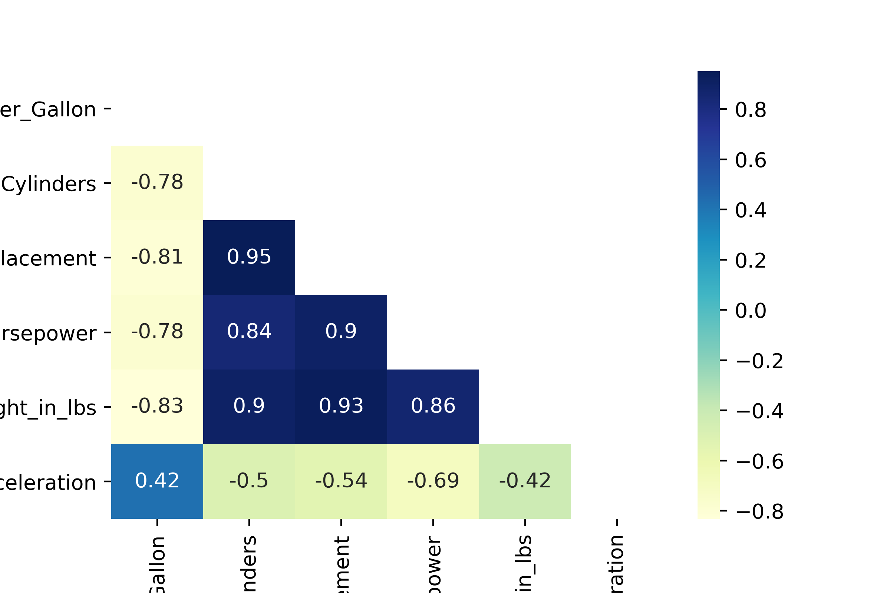

# Cars data test

This example is based on the **cars.json** dataset containing the technical specs of cars.
The dataset is downloaded from UCI Machine Learning Repository and and has been slightly modified (we have removed the attribute ***Years*** because it is of string type and removed ***Name*** attribute because it is an identifier).

For each car we have the following data :

- ***Name*** vehicle Name
- ***Miles_per_Gallon*** urban cycle fuel consumption in miles per gallon
- ***Cylinders*** number of cylinders in a car (between 4 and 8)
- ***Displacement*** engine displacement (cu. inches)
- ***Horsepower*** engine horsepower
- ***Weight_in_lbs*** weight of the car (lbs.)
- ***Acceleration*** time to accelerate (sec.)
- ***Origin*** origin of the car (1. American, 2. European, 3. Japanese)

Consider that the ***Origin*** of the car is a sensitive data and given the original data,

```json
    {
      "Miles_per_Gallon":18,
      "Cylinders":8,
      "Displacement":307,
      "Horsepower":130,
      "Weight_in_lbs":3504,
      "Acceleration":12,
      "Origin":"USA"
   },
   {
      "Miles_per_Gallon":15,
      "Cylinders":8,
      "Displacement":350,
      "Horsepower":165,
      "Weight_in_lbs":3693,
      "Acceleration":11.5,
      "Origin":"USA"
   },
```

This part is intended to show you different anonymization techniques and to show you that this does not significantly affect the correlation of attributes.

## Correlation

To calculate the correlation between each variable of the dataset we use the pearson correlation.
Pearson correlation measures the strength of the linear relationship between two continuous variables. It has a value between -1 to 1, with a value of -1 meaning a total negative linear correlation, 0 being no correlation, and + 1 meaning a total positive correlation.

<<<<<<< HEAD
Pearson Correlation Coefficient :
%20=%20%5Cfrac%7B%5Csum%20%5Cleft%20%5B%20%5Cleft%20(%20x_%7Bi%7D%20-%20%5Cbar%7Bx%7D%20%5Cright%20)%20*%20%5Cleft%20(%20y_%7Bi%7D%20-%20%5Cbar%7By%7D%20%5Cright%20)%20%20%5Cright%20%5D%7D%7B%5Csigma_%7Bx%7D%20*%20%5Csigma_%7By%7D%7D)

With,


```python
import pandas as pd
import numpy as np
import json

input_file = open(r'cars.json')
jsondata = json.load(input_file)
df = pd.DataFrame(jsondata)

df.corr(method='pearson')
```

=======
Pearson Correlation Coefficient =

```math
\rho(x,y) = \frac{\sum [(x_i - \bar{x}) * (y_i - \bar{y})]}{\sigma_x * \sigma_y}
```

With,

```math
\bar{x} \text{ : mean of x variable.} \newline
\bar{y} \text{ : mean of y variable.} \newline
\sigma_x \text{ : standart deviation of x variable.} \newline
\sigma_y \text{ : standart deviation of y variable.}
```

```python
import pandas as pd
import numpy as np
import json

input_file = open(r'cars.json')
jsondata = json.load(input_file)
df = pd.DataFrame(jsondata)

df.corr(method='pearson')
```

>>>>>>> 4378e4e (docs: add demo top bottom coding technique)
|                  | Miles_per_Gallon | Cylinders |     x     | Horsepower |     y     | Acceleration |
|------------------|------------------|:---------:|:---------:|:----------:|:---------:|:------------:|
| Miles_per_Gallon |     1.000000     | -0.777618 | -0.805127 |  -0.778427 | -0.832244 |   0.423329   |
| Cylinders        |     -0.777618    |  1.000000 |  0.950823 |  0.842983  |  0.897527 |   -0.504683  |
| x                |     -0.805127    |  0.950823 |  1.000000 |  0.897257  |  0.932994 |   -0.543800  |
| Horsepower       |     -0.778427    |  0.842983 |  0.897257 |  1.000000  |  0.864538 |   -0.689196  |
| y                |     -0.832244    |  0.897527 |  0.932994 |  0.864538  |  1.000000 |   -0.416839  |
| Acceleration     |     0.423329     | -0.504683 | -0.543800 |  -0.689196 | -0.416839 |   1.000000   |

```python
import seaborn as sb

mask = np.triu(np.ones(df.corr().shape)).astype(np.bool)
plot = sb.heatmap(df.corr(), mask = mask, cmap="YlGnBu", annot=True)
```


