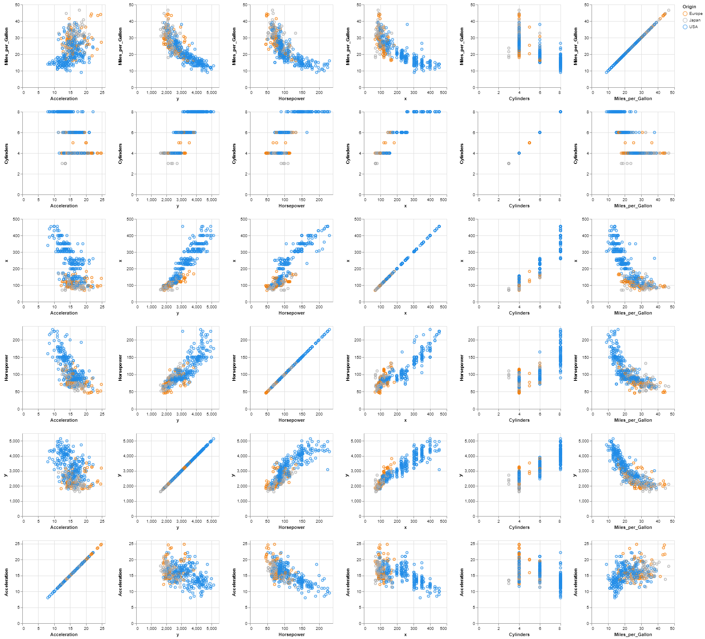
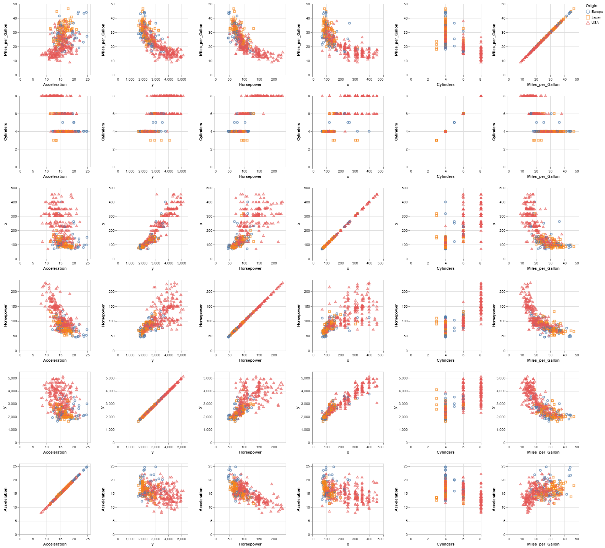

# Cars data test

This example is based on the **cars.json** dataset containing the technical specs of cars.
The dataset is downloaded from UCI Machine Learning Repository and and has been slightly modified (we have removed the attribute ***Years*** and changed the ***Name*** attribute to ***Id***).

For each car we have the following data :

- ***Id*** vehicle id
- ***Miles_per_Gallon*** urban cycle fuel consumption in miles per gallon
- ***Cylinders*** number of cylinders in a car (between 4 and 8)
- ***Displacement*** (***x***) engine displacement (cu. inches)
- ***Horsepower*** engine horsepower
- ***Weight_in_lbs*** (***y***) weight of the car (lbs.)
- ***Acceleration*** time to accelerate (sec.)
- ***Origin*** origin of the car (1. American, 2. European, 3. Japanese)

Consider that the ***Origin*** of the car is a sensitive data and given the original data,



```console
< cars.json | jq -c '.[]' | sigo -q Id,Miles_per_Gallon,Cylinders,x,Horsepower,y,Acceleration -s Origin | jq -s > cars_sigo.json
```



We can see that the anonymisation of the dataset has not changed the correlation of the attributes.
