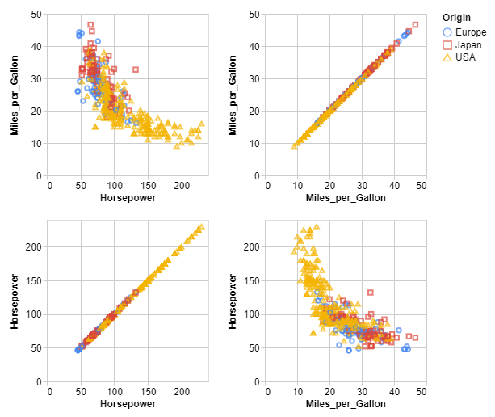
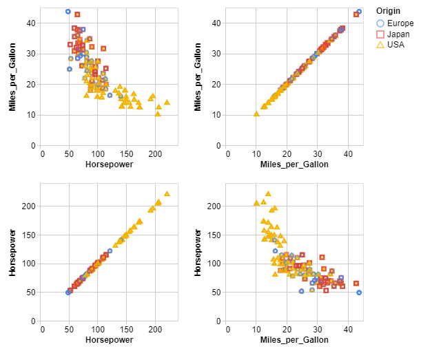
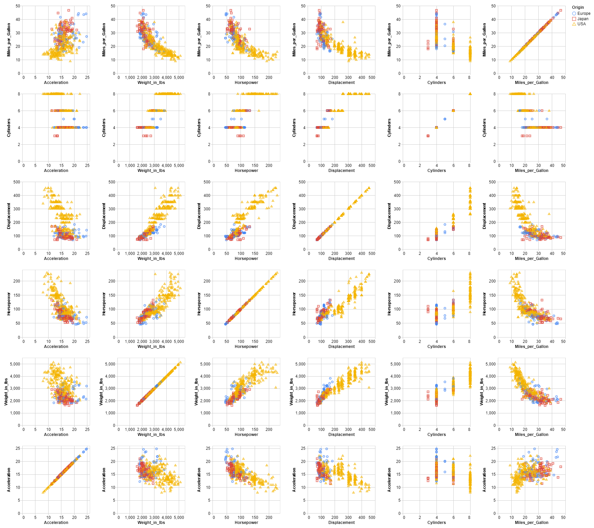
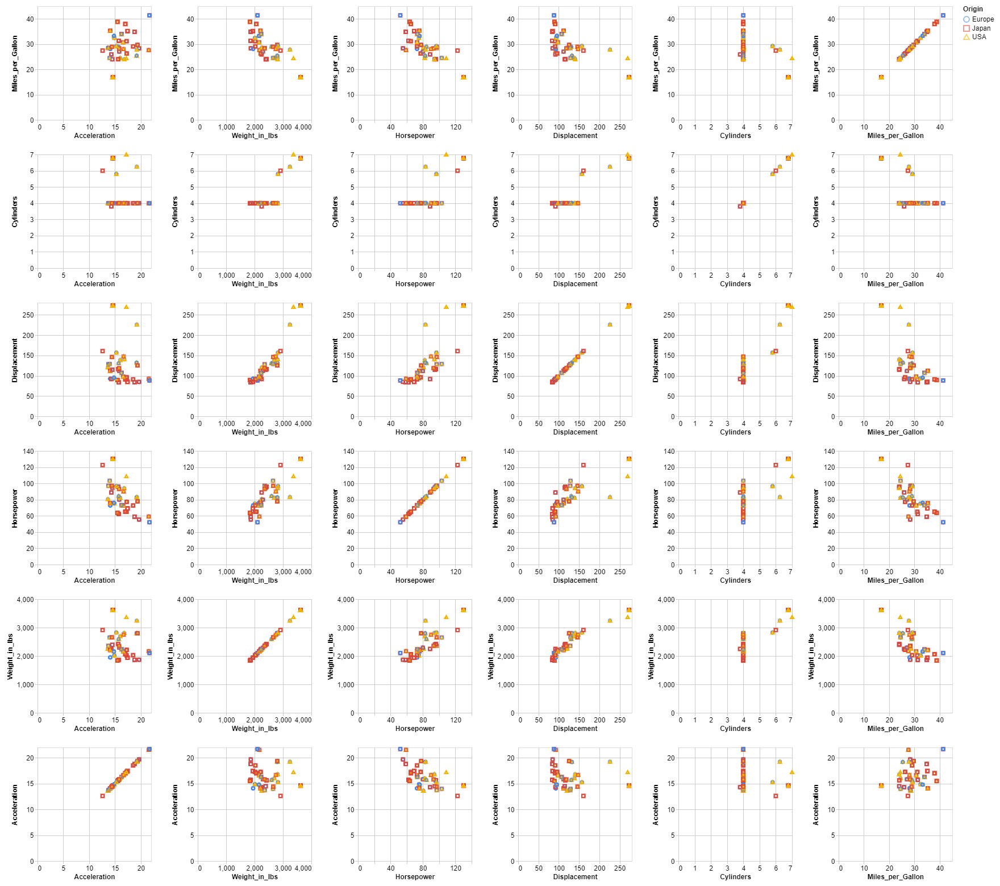

# Micro-Aggregation technique

This technique is applied to continuous data. It is made up of two steps : partitioning and aggregation.

- **Partitioning** is to form groups of at least k records called micro-aggregates.
- **Aggregation** is to group together the values of the same cluster by a central value ( mean or median).

This demo is based on the **cars.json** dataset and the data is aggregated using the average.

## 2-dimension

This part focuses on 2 quasi-identifiers : ***Miles_per_Gallon*** and ***Horsepower***.
The sensitive data is always the attribute ***Origin***.

The data is recorded in the cars2.json file, below you will find an overview of the data :

```json
    {
      "Miles_per_Gallon": 18,
      "Horsepower": 130,
      "Origin": "USA"
    },
    {
      "Miles_per_Gallon": 15,
      "Horsepower": 165,
      "Origin": "USA"
    },
    {
      "Miles_per_Gallon": 18,
      "Horsepower": 150,
      "Origin": "USA"
    },
```

### 1- Original data



|                  | Miles_per_Gallon | Horsepower |
|------------------|------------------|------------|
| Miles_per_Gallon |     1.000000     |  -0.778427 |
| Horsepower       |     -0.778427    |  1.000000  |

### 1- De-identified data

```console
< cars2.json | jq -c '.[]' | sigo -q Miles_per_Gallon,Horsepower -s Origin | jq -s > cars2_sigo.json
```



|                  | Miles_per_Gallon | Horsepower |
|------------------|------------------|------------|
| Miles_per_Gallon |     1.000000     |  -0.788342 |
| Horsepower       |     -0.788342    |  1.000000  |

## n-dimension

This part focuses on 6 quasi-identifiers : ***Miles_per_Gallon***, ***Cylinders***, ***Displacement***, ***Horsepower***, ***Weight_in_lbs*** and ***Acceleration***.
The sensitive data is always the attribute ***Origin***.

The data is recorded in the carsn.json file, below you will find an overview of the data :

```json
   {
      "Miles_per_Gallon": 18,
      "Cylinders": 8,
      "Displacement": 307,
      "Horsepower": 130,
      "Weight_in_lbs": 3504,
      "Acceleration": 12,
      "Origin": "USA"
    },
    {
      "Miles_per_Gallon": 15,
      "Cylinders": 8,
      "Displacement": 350,
      "Horsepower": 165,
      "Weight_in_lbs": 3693,
      "Acceleration": 11.5,
      "Origin": "USA"
    },
```

### 2- Original data



|                  | Miles_per_Gallon | Cylinders | Displacement | Horsepower | Weight_in_lbs | Acceleration |
|------------------|:----------------:|:---------:|:------------:|:----------:|:-------------:|:------------:|
| Miles_per_Gallon |     1.000000     | -0.777618 |   -0.805127  |  -0.778427 |   -0.832244   |   0.423329   |
| Cylinders        |     -0.777618    |  1.000000 |   0.950823   |  0.842983  |    0.897527   |   -0.504683  |
| Displacement     |     -0.805127    |  0.950823 |   1.000000   |  0.897257  |    0.932994   |   -0.543800  |
| Horsepower       |     -0.778427    |  0.842983 |   0.897257   |  1.000000  |    0.864538   |   -0.689196  |
| Weight_in_lbs    |     -0.832244    |  0.897527 |   0.932994   |  0.864538  |    1.000000   |   -0.416839  |
| Acceleration     |     0.423329     | -0.504683 |   -0.543800  |  -0.689196 |   -0.416839   |   1.000000   |

### 2- De-identified data

```console
< carsn.json | jq -c '.[]' | sigo -q Miles_per_Gallon,Cylinders,Displacement,Horsepower,Weight_in_lbs,Acceleration -s Origin | jq -s > carsn_sigo.json
```



|                  | Miles_per_Gallon | Cylinders | Displacement | Horsepower | Weight_in_lbs | Acceleration |
|------------------|:----------------:|:---------:|:------------:|:----------:|:-------------:|:------------:|
| Miles_per_Gallon |     1.000000     | -0.880184 |   -0.920294  |  -0.941530 |   -0.927248   |   0.546557   |
| Cylinders        |     -0.880184    |  1.000000 |   0.980862   |  0.932552  |    0.951283   |   -0.501903  |
| Displacement     |     -0.920294    |  0.980862 |   1.000000   |  0.962581  |    0.985833   |   -0.528976  |
| Horsepower       |     -0.941530    |  0.932552 |   0.962581   |  1.000000  |    0.964514   |   -0.669607  |
| Weight_in_lbs    |     -0.927248    |  0.951283 |   0.985833   |  0.964514  |    1.000000   |   -0.500590  |
| Acceleration     |     0.546557     | -0.501903 |   -0.528976  |  -0.669607 |   -0.500590   |   1.000000   |

The correlation after anonymization is in the range $\left[ \pm 0.003; \pm 0.163\right]$.

### Bibliography

***D. Defays and P. Nanopoulos***, **"Panels of enterprises and confidentiality: The small aggregates method"**,
[in 92 Symposium on Design and Analysis of Longitudinal Surveys, Canada, Ottawa, 1993, 195–204](<https://publications.gc.ca/site/eng/9.844634/publication.html#:~:text=Symposium%2092%20%3A%20design%20and%20analysis%20of%20longitudinal,year%20the%20symposium%20focuses%20on%20a%20particular%20theme>).
