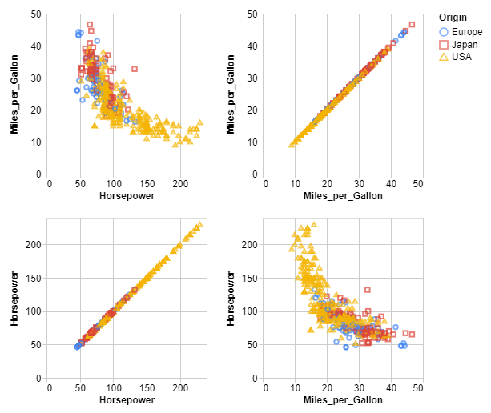
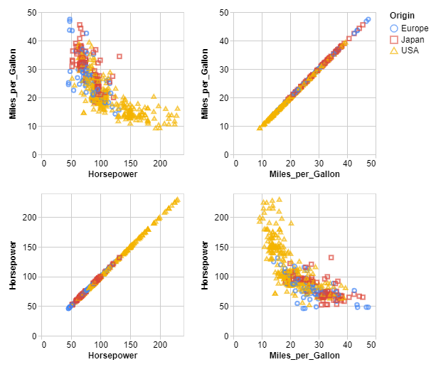
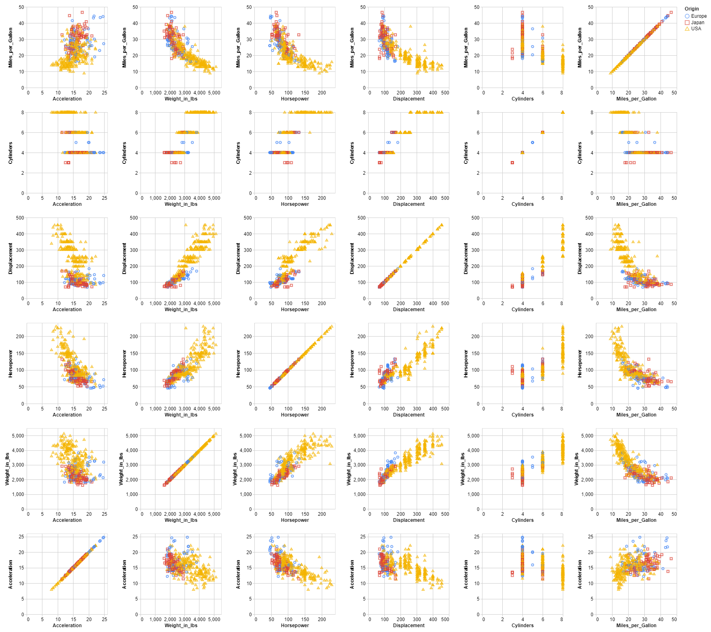
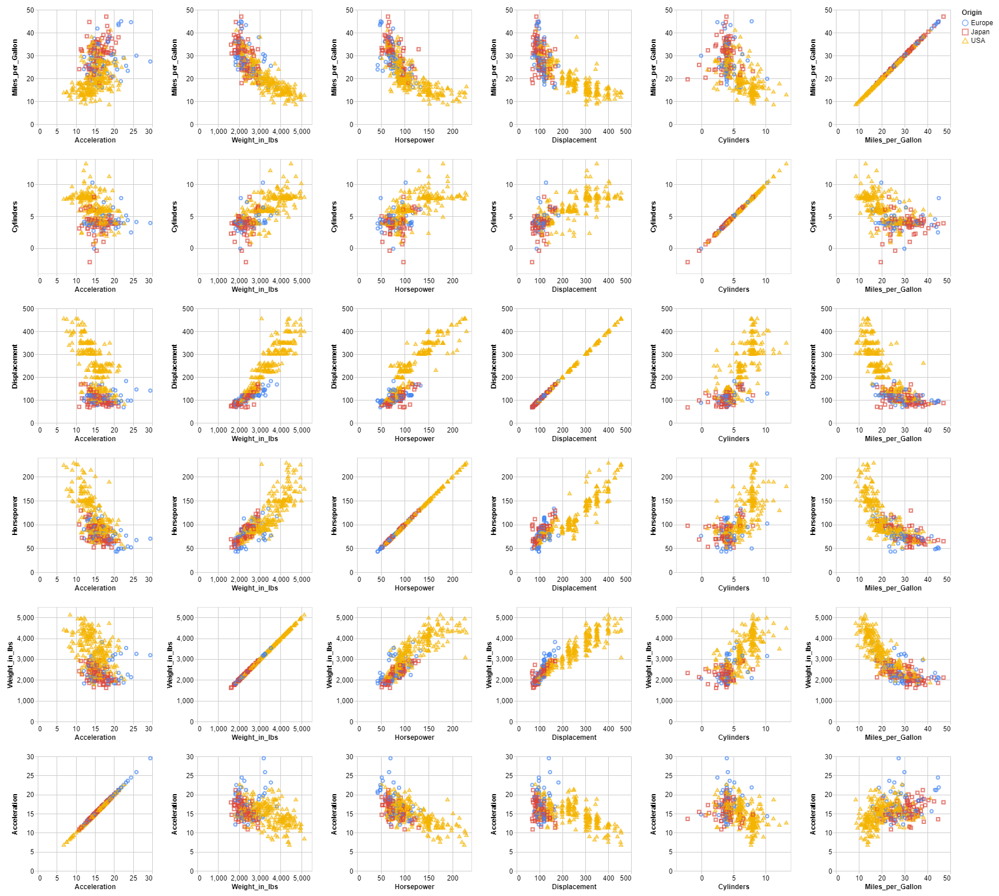

# Random Noise

It consists in adding random noise on quantitative variables.

This demo is based on the **cars.json** dataset and the added noise comes from a **Laplace** distribution.

## 2-dimension

This part focuses on 2 quasi-identifiers : ***Miles_per_Gallon*** and ***Horsepower***.
The sensitive data is always the attribute ***Origin***.

The data is recorded in the cars2.json file, below you will find an overview of the data :

```json
    {
      "Miles_per_Gallon": 18,
      "Horsepower": 130,
      "Origin": "USA"
    },
    {
      "Miles_per_Gallon": 15,
      "Horsepower": 165,
      "Origin": "USA"
    },
    {
      "Miles_per_Gallon": 18,
      "Horsepower": 150,
      "Origin": "USA"
    },
```

### 1- Original data



|                  | Miles_per_Gallon | Horsepower |
|------------------|------------------|------------|
| Miles_per_Gallon |     1.000000     |  -0.778427 |
| Horsepower       |     -0.778427    |  1.000000  |

### 1- De-identified data

```console
< cars2.json | jq -c '.[]' | sigo -q Miles_per_Gallon,Horsepower -s Origin | jq -s > cars2_sigo.json
```



|                  | Miles_per_Gallon | Horsepower |
|------------------|------------------|------------|
| Miles_per_Gallon |     1.000000     |  -0.764425 |
| Horsepower       |     -0.764425    |  1.000000  |

## n-dimension

This part focuses on 6 quasi-identifiers : ***Miles_per_Gallon***, ***Cylinders***, ***Displacement***, ***Horsepower***, ***Weight_in_lbs*** and ***Acceleration***.
The sensitive data is always the attribute ***Origin***.

The data is recorded in the carsn.json file, below you will find an overview of the data :

```json
   {
      "Miles_per_Gallon": 18,
      "Cylinders": 8,
      "Displacement": 307,
      "Horsepower": 130,
      "Weight_in_lbs": 3504,
      "Acceleration": 12,
      "Origin": "USA"
    },
    {
      "Miles_per_Gallon": 15,
      "Cylinders": 8,
      "Displacement": 350,
      "Horsepower": 165,
      "Weight_in_lbs": 3693,
      "Acceleration": 11.5,
      "Origin": "USA"
    },
```

### 2- Original data



|                  | Miles_per_Gallon | Cylinders | Displacement | Horsepower | Weight_in_lbs | Acceleration |
|------------------|:----------------:|:---------:|:------------:|:----------:|:-------------:|:------------:|
| Miles_per_Gallon |     1.000000     | -0.777618 |   -0.805127  |  -0.778427 |   -0.832244   |   0.423329   |
| Cylinders        |     -0.777618    |  1.000000 |   0.950823   |  0.842983  |    0.897527   |   -0.504683  |
| Displacement     |     -0.805127    |  0.950823 |   1.000000   |  0.897257  |    0.932994   |   -0.543800  |
| Horsepower       |     -0.778427    |  0.842983 |   0.897257   |  1.000000  |    0.864538   |   -0.689196  |
| Weight_in_lbs    |     -0.832244    |  0.897527 |   0.932994   |  0.864538  |    1.000000   |   -0.416839  |
| Acceleration     |     0.423329     | -0.504683 |   -0.543800  |  -0.689196 |   -0.416839   |   1.000000   |

### 2- De-identified data

```console
< carsn.json | jq -c '.[]' | sigo -q Miles_per_Gallon,Cylinders,Displacement,Horsepower,Weight_in_lbs,Acceleration -s Origin | jq -s > carsn_sigo.json
```



|                  | Miles_per_Gallon | Cylinders | Displacement | Horsepower | Weight_in_lbs | Acceleration |
|------------------|:----------------:|:---------:|:------------:|:----------:|:-------------:|:------------:|
| Miles_per_Gallon |     1.000000     | -0.618830 |   -0.797633  |  -0.768155 |   -0.822276   |   0.405036   |
| Cylinders        |     -0.618830    |  1.000000 |   0.787183   |  0.704369  |    0.748811   |   -0.398250  |
| Displacement     |     -0.797633    |  0.787183 |   1.000000   |  0.897594  |    0.933043   |   -0.529400  |
| Horsepower       |     -0.768155    |  0.704369 |   0.897594   |  1.000000  |    0.864810   |   -0.653690  |
| Weight_in_lbs    |     -0.822276    |  0.748811 |   0.933043   |  0.864810  |    1.000000   |   -0.402344  |
| Acceleration     |     0.405036     | -0.398250 |   -0.529400  |  -0.653690 |   -0.402344   |   1.000000   |

The correlation after anonymization is in the range 

### Bibliography

***Brand, Ruth.***, **"Microdata Protection through Noise Addition"**,
[in Inference Control in Statistical Databases, From Theory to Practice, 2002, 97‑116](<https://link.springer.com/chapter/10.1007/3-540-47804-3_8?code=d7da801e-b5d7-4f86-8820-3547ba948938>).
