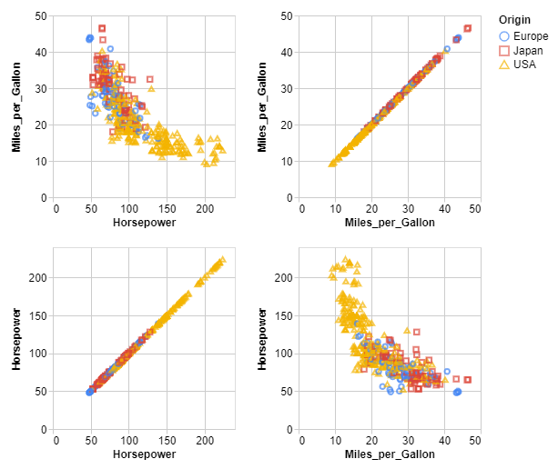
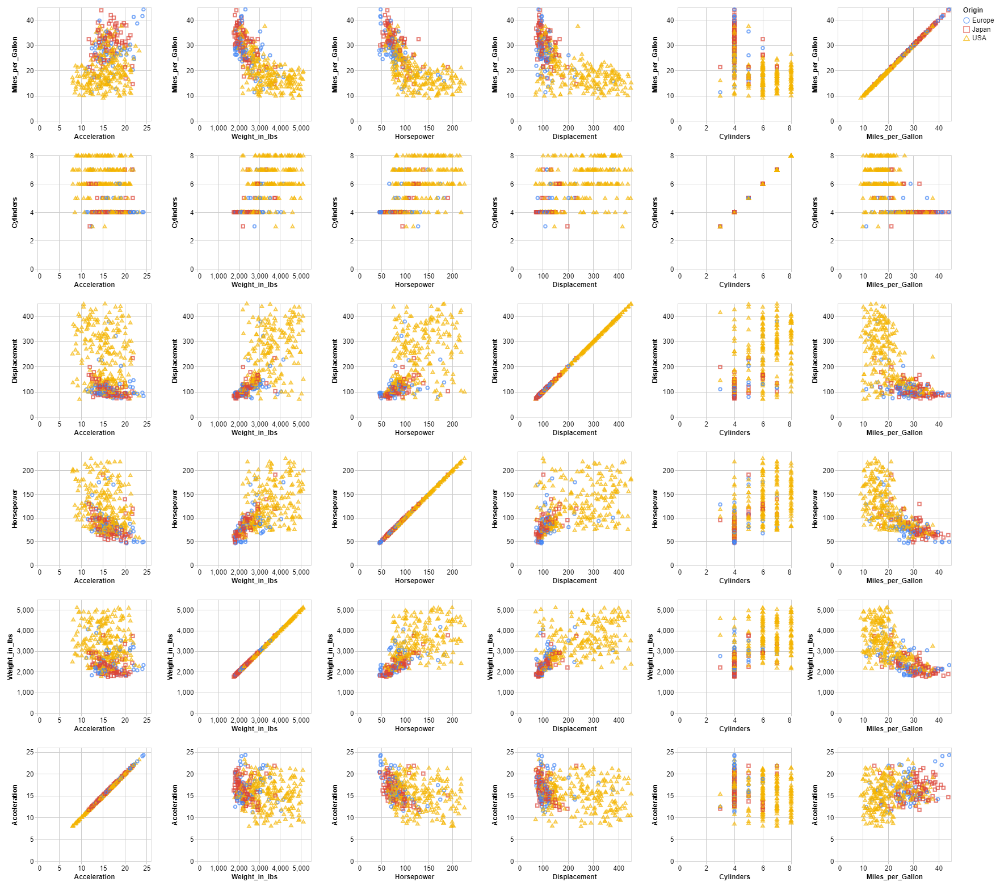

# Random Noise

It consists in adding random noise on quantitative variables.

This demo is based on the **cars.json** dataset and the added noise comes from a **Laplace** distribution.

## 2-dimension

This part focuses on 2 quasi-identifiers : ***Miles_per_Gallon*** and ***Horsepower***.
The sensitive data is always the attribute ***Origin***.

The data is recorded in the cars2.json file, below you will find an overview of the data :

```json
    {
      "Miles_per_Gallon": 18,
      "Horsepower": 130,
      "Origin": "USA"
    },
    {
      "Miles_per_Gallon": 15,
      "Horsepower": 165,
      "Origin": "USA"
    },
    {
      "Miles_per_Gallon": 18,
      "Horsepower": 150,
      "Origin": "USA"
    },
```

### 1- Original data


|                  | Miles_per_Gallon | Horsepower |
|------------------|------------------|------------|
| Miles_per_Gallon |     1.000000     |  -0.778427 |
| Horsepower       |     -0.778427    |  1.000000  |

### 1- De-identified data

```console
< cars2.json | jq -c '.[]' | sigo -q Miles_per_Gallon,Horsepower -s Origin -a laplaceNoise | jq -s > cars2_sigo.json
```

#### Use PIMO with 2-dimension

The ***Horsepower*** attribute is a discrete attribute so to keep the dataset consistent we use `pimo` to not change the type of this variable after anonymization.

```console
< cars2_sigo.json | jq -c '.[]' | pimo -c masking2.yml > cars2_sigo_pimo.json
```

We use the following `masking2.yml` file,

``` yaml
version: "1"
seed: 42
masking:
  - selector:
      jsonpath: "Horsepower"
    mask:
      template: "{{round (toString .Horsepower) 0 }}"

  - selector:
      jsonpath: "Horsepower"
    mask:
      fromjson: "Horsepower"
```



|                  | Miles_per_Gallon | Horsepower |
|------------------|------------------|------------|
| Miles_per_Gallon |     1.000000     | -0.778628  |
| Horsepower       |    -0.778628     |  1.000000  |

## n-dimension

This part focuses on 6 quasi-identifiers : ***Miles_per_Gallon***, ***Cylinders***, ***Displacement***, ***Horsepower***, ***Weight_in_lbs*** and ***Acceleration***.
The sensitive data is always the attribute ***Origin***.

The data is recorded in the carsn.json file, below you will find an overview of the data :

```json
   {
      "Miles_per_Gallon": 18,
      "Cylinders": 8,
      "Displacement": 307,
      "Horsepower": 130,
      "Weight_in_lbs": 3504,
      "Acceleration": 12,
      "Origin": "USA"
    },
    {
      "Miles_per_Gallon": 15,
      "Cylinders": 8,
      "Displacement": 350,
      "Horsepower": 165,
      "Weight_in_lbs": 3693,
      "Acceleration": 11.5,
      "Origin": "USA"
    },
```

### 2- Original data


|                  | Miles_per_Gallon | Cylinders | Displacement | Horsepower | Weight_in_lbs | Acceleration |
|------------------|:----------------:|:---------:|:------------:|:----------:|:-------------:|:------------:|
| Miles_per_Gallon |     1.000000     | -0.777618 |   -0.805127  |  -0.778427 |   -0.832244   |   0.423329   |
| Cylinders        |     -0.777618    |  1.000000 |   0.950823   |  0.842983  |    0.897527   |   -0.504683  |
| Displacement     |     -0.805127    |  0.950823 |   1.000000   |  0.897257  |    0.932994   |   -0.543800  |
| Horsepower       |     -0.778427    |  0.842983 |   0.897257   |  1.000000  |    0.864538   |   -0.689196  |
| Weight_in_lbs    |     -0.832244    |  0.897527 |   0.932994   |  0.864538  |    1.000000   |   -0.416839  |
| Acceleration     |     0.423329     | -0.504683 |   -0.543800  |  -0.689196 |   -0.416839   |   1.000000   |

### 2- De-identified data

```console
< carsn.json | jq -c '.[]' | sigo -q Miles_per_Gallon,Cylinders,Displacement,Horsepower,Weight_in_lbs,Acceleration -s Origin -a laplaceNoise | jq -s > carsn_sigo.json
```

#### Use PIMO with n-dimension

The ***Cylinders***,  ***Horsepower*** and ***Weight_in_lbs*** attributes are discrete attributes so to keep the dataset consistent we use `pimo` to not change the type of these variables after anonymization.

```console
< carsn_sigo.json | jq -c '.[]' | pimo -c maskingn.yml > carsn_sigo_pimo.json
```

We use the following `maskingn.yml` file,

``` yaml
version: "1"
seed: 42
masking:
  - selector:
      jsonpath: "Cylinders"
    mask:
      template: "{{round (toString .Cylinders) 0 }}"

  - selector:
      jsonpath: "Cylinders"
    mask:
      fromjson: "Cylinders"

  ...
```



|                  | Miles_per_Gallon | Cylinders | Displacement | Horsepower | Weight_in_lbs | Acceleration |
|------------------|:----------------:|:---------:|:------------:|:----------:|:-------------:|:------------:|
| Miles_per_Gallon |     1.000000     | -0.636459 |   -0.648962  |  -0.700922 |   -0.711799   |   0.269291   |
| Cylinders        |     -0.636459    |  1.000000 |   0.657736   |  0.610500  |    0.665301   |   -0.175330  |
| Displacement     |     -0.648962    |  0.657736 |   1.000000   |  0.577905  |    0.672666   |   -0.239672  |
| Horsepower       |     -0.700922    |  0.610500 |   0.577905   |  1.000000  |    0.638299   |   -0.332941  |
| Weight_in_lbs    |     -0.711799    |  0.665301 |   0.672666   |  0.638299  |    1.000000   |   -0.170356  |
| Acceleration     |     0.269291     | -0.175330 |   -0.239672  |  -0.332941 |   -0.170356   |   1.000000   |

The correlation after anonymization is in the range 

### Bibliography

***Brand, Ruth.***, **"Microdata Protection through Noise Addition"**,
[in Inference Control in Statistical Databases, From Theory to Practice, 2002, 97‑116](<https://link.springer.com/chapter/10.1007/3-540-47804-3_8?code=d7da801e-b5d7-4f86-8820-3547ba948938>).
