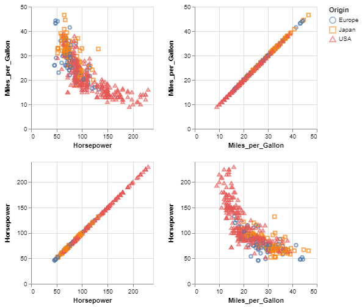
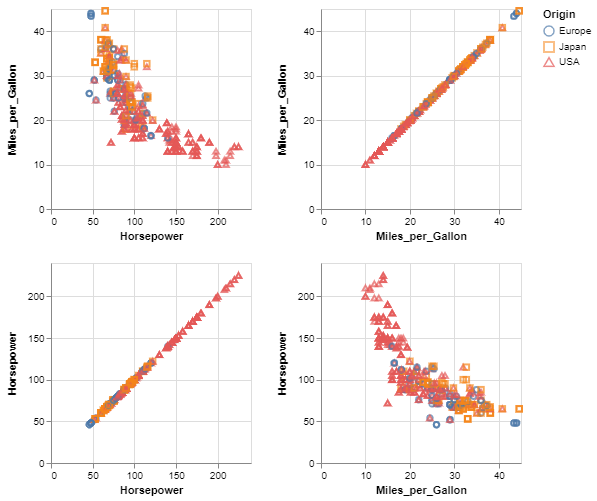
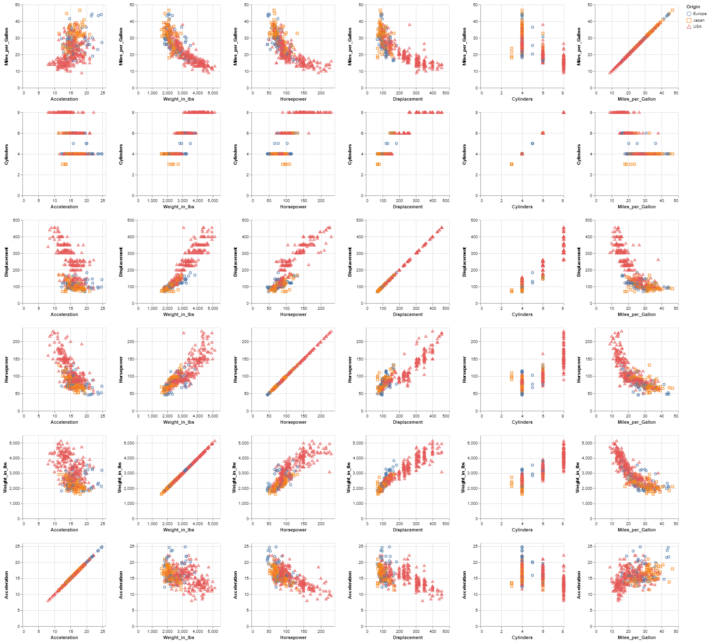
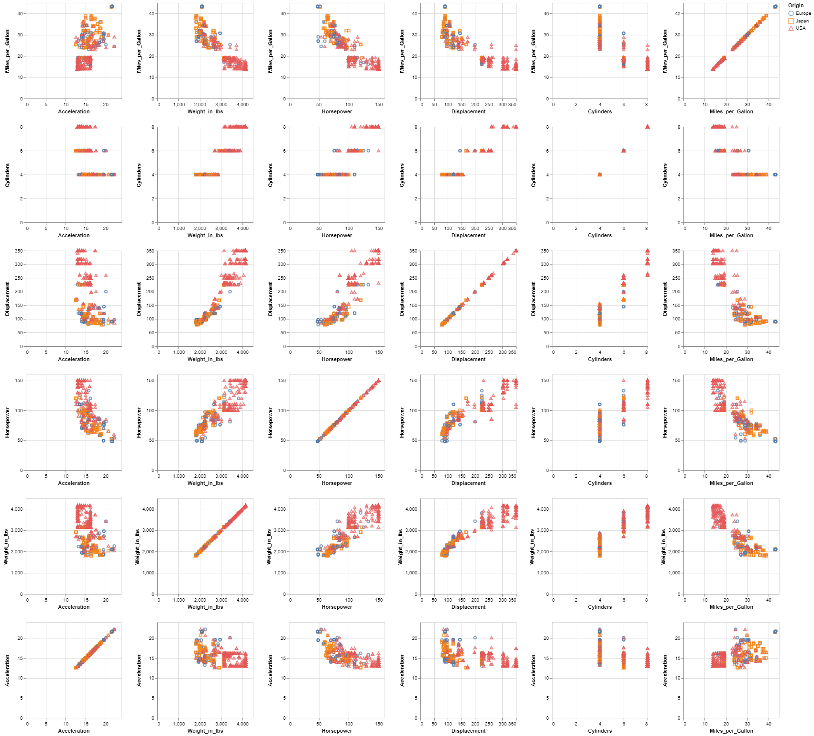

# Top Coding and Bottom Coding technique

It consists in setting top-codes or bottom-codes on quantitative variables.

- **Top Coding** for a variable is to replace by the upper limit any value greater than this limit.
- Similarly, **Bottom Coding** is to replace by the lower limit all values less than this limit.

Different limits may be used for different quantitative variables, here we use a percentage provided by the user that defines the number of upper values and the number of lower values that should be hidden.

This demo is based on the **cars.json** dataset and the hidden value percentage is ***25%***.

## 2-dimension

This part focuses on 2 quasi-identifiers : ***Miles_per_Gallon*** and ***Horsepower***.
The sensitive data is always the attribute ***Origin***.

The data is recorded in the cars2.json file, below you will find an overview of the data :

```json
    {
      "Miles_per_Gallon": 18,
      "Horsepower": 130,
      "Origin": "USA"
    },
    {
      "Miles_per_Gallon": 15,
      "Horsepower": 165,
      "Origin": "USA"
    },
    {
      "Miles_per_Gallon": 18,
      "Horsepower": 150,
      "Origin": "USA"
    },
```

### 1- Original data



|                  | Miles_per_Gallon | Horsepower |
|------------------|------------------|------------|
| Miles_per_Gallon |     1.000000     |  -0.778427 |
| Horsepower       |     -0.778427    |  1.000000  |

### 1- De-identified data

```console
< cars2.json | jq -c '.[]' | sigo -q Miles_per_Gallon,Horsepower -s Origin | jq -s > cars2_sigo.json
```



|                  | Miles_per_Gallon | Horsepower |
|------------------|------------------|------------|
| Miles_per_Gallon |     1.000000     |  -0.790867 |
| Horsepower       |     -0.790867    |  1.000000  |

## n-dimension

This part focuses on 6 quasi-identifiers : ***Miles_per_Gallon***, ***Cylinders***, ***Displacement***, ***Horsepower***, ***Weight_in_lbs*** and ***Acceleration***.
The sensitive data is always the attribute ***Origin***.

The data is recorded in the carsn.json file, below you will find an overview of the data :

```json
   {
      "Miles_per_Gallon": 18,
      "Cylinders": 8,
      "Displacement": 307,
      "Horsepower": 130,
      "Weight_in_lbs": 3504,
      "Acceleration": 12,
      "Origin": "USA"
    },
    {
      "Miles_per_Gallon": 15,
      "Cylinders": 8,
      "Displacement": 350,
      "Horsepower": 165,
      "Weight_in_lbs": 3693,
      "Acceleration": 11.5,
      "Origin": "USA"
    },
```

### 2- Original data



|                  | Miles_per_Gallon | Cylinders | Displacement | Horsepower | Weight_in_lbs | Acceleration |
|------------------|:----------------:|:---------:|:------------:|:----------:|:-------------:|:------------:|
| Miles_per_Gallon |     1.000000     | -0.777618 |   -0.805127  |  -0.778427 |   -0.832244   |   0.423329   |
| Cylinders        |     -0.777618    |  1.000000 |   0.950823   |  0.842983  |    0.897527   |   -0.504683  |
| Displacement     |     -0.805127    |  0.950823 |   1.000000   |  0.897257  |    0.932994   |   -0.543800  |
| Horsepower       |     -0.778427    |  0.842983 |   0.897257   |  1.000000  |    0.864538   |   -0.689196  |
| Weight_in_lbs    |     -0.832244    |  0.897527 |   0.932994   |  0.864538  |    1.000000   |   -0.416839  |
| Acceleration     |     0.423329     | -0.504683 |   -0.543800  |  -0.689196 |   -0.416839   |   1.000000   |

### 2- De-identified data

```console
< carsn.json | jq -c '.[]' | sigo -q Miles_per_Gallon,Cylinders,Displacement,Horsepower,Weight_in_lbs,Acceleration -s Origin | jq -s > carsn_sigo.json
```



|                  | Miles_per_Gallon | Cylinders | Displacement | Horsepower | Weight_in_lbs | Acceleration |
|------------------|:----------------:|:---------:|:------------:|:----------:|:-------------:|:------------:|
| Miles_per_Gallon |     1.000000     | -0.844897 |   -0.889392  |  -0.865198 |   -0.896857   |   0.534477   |
| Cylinders        |     -0.844897    |  1.000000 |   0.972057   |  0.916422  |    0.930259   |   -0.554863  |
| Displacement     |     -0.889392    |  0.972057 |   1.000000   |  0.933822  |    0.963663   |   -0.567617  |
| Horsepower       |     -0.865198    |  0.916422 |   0.933822   |  1.000000  |    0.917956   |   -0.714646  |
| Weight_in_lbs    |     -0.896857    |  0.930259 |   0.963663   |  0.917956  |    1.000000   |   -0.507366  |
| Acceleration     |     0.534477     | -0.554863 |   -0.567617  |  -0.714646 |   -0.507366   |   1.000000   |

The correlation after anonymization is in the range 

### Bibliography

***Domingo-Ferrer, Josep, and Vicenc Torra.***, **"A quantitative comparison of disclosure control methods for microdata"**,
[in Confidentiality, disclosure and data access: theory and practical applications for statistical agencies, 2001, 111–134.](<https://www.researchgate.net/publication/33675153_Confidentiality_Disclosure_and_Data_Access_Theory_and_Practical_Applications_for_Statistical_Agencies>).

***Domingo-Ferrer, Josep, and Vicenç Torra.*** **"Distance-based and probabilistic record linkage for reidentification of records with categorical variables"**. [in Butlletí de lACIA, Associació Catalana dIntelligència Artificial, 2002.](<https://www.researchgate.net/profile/Josep-Domingo-Ferrer/publication/228807929_Distance-based_and_probabilistic_record_linkage_for_re-identification_of_records_with_categorical_variables/links/0deec5167b9f44e498000000/Distance-based-and-probabilistic-record-linkage-for-re-identification-of-records-with-categorical-variables.pdf>).
