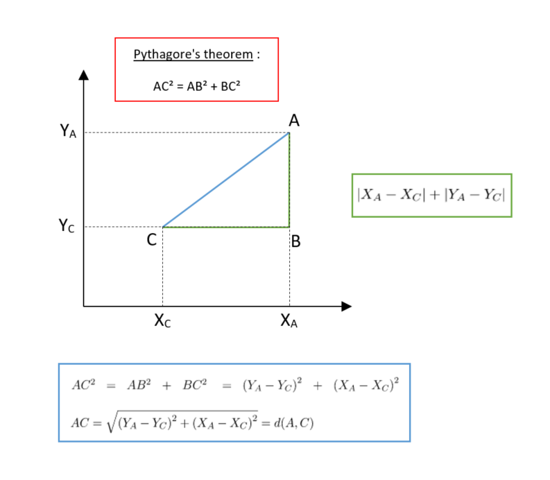
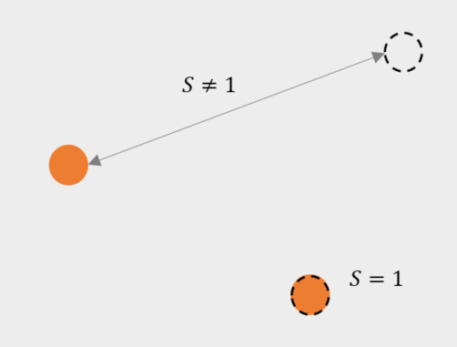
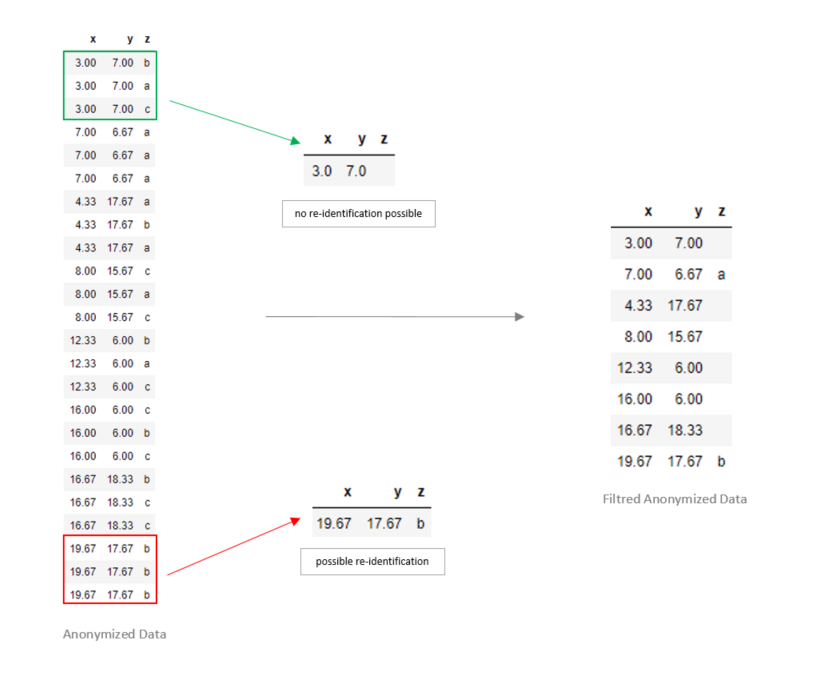
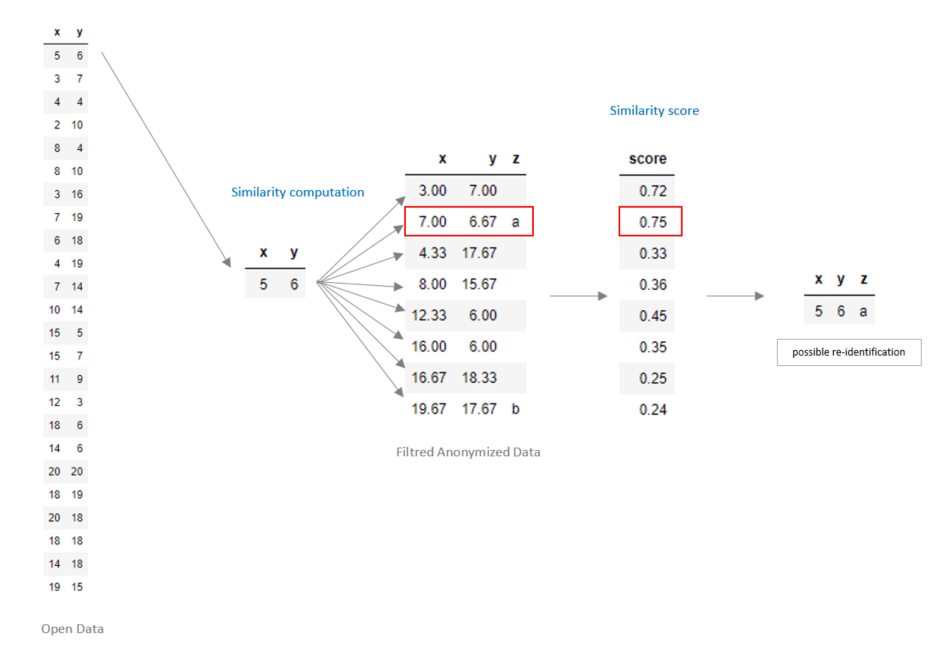

# REIDENTIFICATION

With the evolution of information technologies that make it possible to link data from different sources, it is almost impossible to guarantee an anonymization that would offer a zero risk of re-identification.

**Re-identification Definition :** A process (or algorithm) that takes an anonymized dataset and related knowledge as input and seeks to match the anonymized data with real-world individuals.

Let's take as an example a very simple dataset that you can find in the `original.json` file.

```json
{"x": 5, "y": 6, "z":"a"}
{"x": 3, "y": 7, "z":"a"}
{"x": 4, "y": 4, "z":"c"}
{"x": 2, "y": 10, "z":"b"}
{"x": 8, "y": 4, "z":"a"}
...
```

And suppose that we have 2 quasi-identifiers: `x` and `y` and as sensitive data the variable `z`. Anonymize the dataset using `sigo`, we use sigo's default settings **k=3** and **l=1** with the **meanAggregation** method :

```console
sigo -q x,y -s z -a meanAggregation < original.json > anonymized.json
```

```json
{"x":3,"y":7,"z":"b"}
{"x":3,"y":7,"z":"a"}
{"x":3,"y":7,"z":"c"}
{"x":7,"y":6.67,"z":"a"}
{"x":7,"y":6.67,"z":"a"}
...
```

**Objective :** Identify for each individual in the original dataset (data from the open data) whether an anonymized individual is similar to him assuming the worst case scenario, i.e. the attacker has the original dataset but not the sensitive data.

The data that the attacker has is in the `openData.json` file.

```json
{"x": 5, "y": 6}
{"x": 3, "y": 7}
{"x": 4, "y": 4}
{"x": 2, "y": 10}
{"x": 8, "y": 4}
...
```


Our method of re-identification is to find the closest or most similar individuals.

This approach depends greatly on the concepts of distance and similarity.

## Key concepts

**Definition of distance :** (*wikipédia*)
We call distance, on a set , any application `d` defined on  and with values in the set of positive or zero real numbers (),

> 

verifying the following properties :

- symmetry : %20%5Cin%20E%5E%7B2%7D,%20d(a,b)%20=%20d(b,a)%20)
- separation : %20%5Cin%20E%5E%7B2%7D,%20d(a,b)%20=%200%20%5CLeftrightarrow%20a%20=%20b%20)
- triangular inequality : %20%5Cin%20E%5E%7B3%7D,%20d(a,c)%20%5Cleq%20d(a,b)%20&plus;%20d(b,c))

The best known distances are the **Euclidean distance** and the **Manhattan distance**.


|%20=%20%5Csqrt%7B%5Csum_%7Bi=1%7D%5E%7Bn%7D%5Cleft%20(%20a_%7Bi%7D%20-%20b_%7Bi%7D%20%5Cright%20)%5E%7B2%7D%7D%20) | %20=%20%5Csum_%7Bi=1%7D%5E%7Bn%7D%20%5Cleft%7C%20a_%7Bi%7D%20-%20b_%7Bi%7D%20%5Cright%7C) |
|:----------------------:|:---------------------:|
| **Euclidean** distance | **Manhattan** distance|



> https://towardsdatascience.com/17-types-of-similarity-and-dissimilarity-measures-used-in-data-science-3eb914d2681

We can use a distance to define a similarity: the more two points are distant, the less similar they are, and inversely. We can then transform a distance `d` into a similarity `s` in the following way :

> Similarity
> 

A similarity index is between 0 and 1 where 0 indicates a total difference between the points and 1 indicates a total similarity.

We have the following properties :




## Approach

The approach is as follows :

- Individuals with the same tuples of quasi-identifiers are grouped together.
- If individuals in a group have the same value of sensitive data :

> ```diff
> - then this sensitive data is given,
> + else it is not given
> ```



- After that, we calculate the similarity between each individual collected from the open data and the filtered individuals of the anonymized dataset.
- If similarity score is higher than the `threshold` set by the user and the sensitive data is found, then the individual can be re-identified.



Below is the use of `sigo` for re-identification with a `threshold` set to **0.6**.

```console
sigo reidentification -q x,y -s z --load-original examples/re-identification/openData.json --load-anonymized examples/re-identification/anonymized.json --threshold 0.6
```

```json
{"x":5,"y":6,"sensitive":["a"]}
{"x":8,"y":4,"sensitive":["a"]}
{"x":8,"y":10,"sensitive":["a"]}
{"x":20,"y":20,"sensitive":["b"]}
{"x":20,"y":18,"sensitive":["b"]}
{"x":19,"y":15,"sensitive":["b"]}
```

