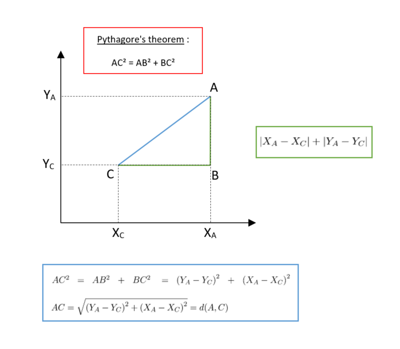
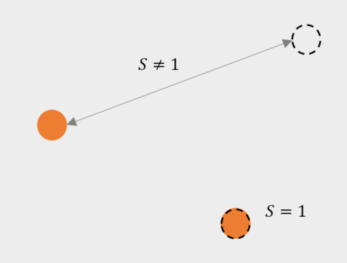

# Reidentification key concepts

**Definition of distance :** (*wikipédia*)
We call distance, on a set $E$, any application $d$ defined on $E^2$ and with values in the set of positive or zero real numbers $\left( \mathbb{R}^+ \right)$,

> $$d: E \times E \to \mathbb{R}^+$$

verifying the following properties :

> symmetry :

$$\forall (a,b) \in E^2, d(a,b) = d(b,a)$$

> separation :

$$\forall (a,b) \in E^2, d(a,b) = 0 \Leftrightarrow a = b$$

> triangular inequality :

$$\forall (a,b,c) \in E^3, d(a,c) \leq d(a,b) + d(b,c)$$

The best known distances are the **Euclidean distance** and the **Manhattan distance**.

> **Euclidean** distance :

$$d(a,b) = \sqrt{\sum_{i=1}^{n} \left( a_i - b_i \right)^2} $$

> **Manhattan** distance :

$$d(a,b) = \sum_{i=1}^{n} \left| a_i - b_i \right| $$

> https://towardsdatascience.com/17-types-of-similarity-and-dissimilarity-measures-used-in-data-science-3eb914d2681

We can use a distance to define a similarity: the more two points are distant, the less similar they are, and inversely. We can then transform a distance $d$ into a similarity $s$ in the following way :

> Similarity
> $$ s = \frac{1}{1+d}$$

A similarity index is between 0 and 1 where 0 indicates a total difference between the points and 1 indicates a total similarity.

We have the following properties :

> $$ \left\{\begin{matrix}
 d = 0 & \Leftrightarrow & s = 1 \\
 d = +\infty & \Leftrightarrow & s = 0 \\
\end{matrix}\right. $$

