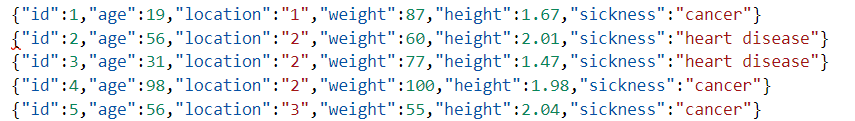
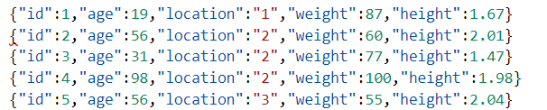
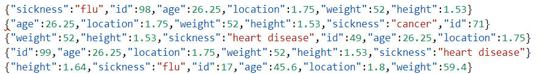
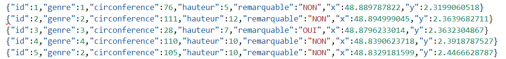
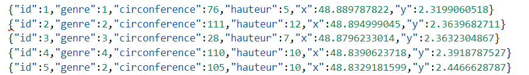

# TEST REIDENTIFICATION

## 1st Dataset (100 rows)

```console
sigo -q age,location,weight,height -s sickness -a meanAggregation < data1/original.json > data1/anonymized.json
```

||||
|:-------------:|:---------:|:---------------:|
| Original Data | Open Data | Anonymized Data |

```console
sigo reidentification -q age,location,weight,height -s sickness -o examples/re-identification/test/data1/openData.json -m examples/re-identification/test/data1/anonymized.json
```

```console
8:13AM INF Reidentification mode Quasi-Identifiers=["age","location","weight","height"] Sensitive=["sickness"] anonymizedData=examples/re-identification/test/data1/anonymized11.json openData=examples/re-identification/test/data1/openData.json threshold=0.5
8:13AM INF Loading Data
8:13AM INF Initializing Identifier metric used=euclidean threshold=0.5
8:13AM INF Scaling Data
8:13AM INF Re-identifying Data

{"height":1.95,"id":58,"age":97,"sensitive":["cancer"],"similarity":61.85,"location":"3","weight":92}
{"id":70,"age":92,"location":"3","weight":101,"height":1.88,"sensitive":["cancer"],"similarity":55.1}
```

```json
{"id":58,"age":97,"location":"3","weight":92,"height":1.95,"sickness":"cancer"}
{"id":70,"age":92,"location":"3","weight":101,"height":1.88,"sickness":"cancer"}
```

### Results Dataset1

`sigo` parameter: `data1/anonymized11.json`

- k = 3
- l = 1
- method = *meanAggregation*

**Euclidean:**
| Re-identify  |  13  |   9  |  2  |  0  |
|:------------:|:----:|:----:|:---:|:---:|
| threshold    |   0  |  0.4 | 0.5 | 0.7 |
|   correctly  |  10  |   8  |  2  |  0  |
|  incorrectly |   3  |   1  |  0  |  0  |
|     ratio    | 0.76 | 0.88 |  1  |  0  |

**Cosine:**
| Re-identify  |  12  |  12  |   9  |  8  |
|:------------:|:----:|:----:|:----:|:---:|
| threshold    |   0  |  0.4 | 0.75 | 0.8 |
|   correctly  |  10  |  10  |   9  |  8  |
|  incorrectly |   2  |   2  |   0  |  0  |
|     ratio    | 0.83 | 0.83 |   1  |  1  |

`sigo` parameter: `data1/anonymized12.json`

- k = 3
- l = 3
- method = *meanAggregation*

**Euclidean & Cosine:**
| Re-identify  | 0 |
|:------------:|:-:|
| threshold    | 0 |
|   correctly  | 0 |
|  incorrectly | 0 |

`sigo` parameter: `data1/anonymized13.json`

- k = 3
- l = 3
- method = *gaussianNoise*

**Euclidean:**
| Re-identify  |  100 |  76  |   40   |    8    |  0  |
|:------------:|:----:|:----:|:------:|:-------:|:---:|
|   threshold  |   0  | 0.4  |  0.5   |   0.7   | 0.8 |
|   correctly  |  55  |  45  |   25   |    5    |  0  |
|  incorrectly |  45  |  31  |   15   |    3    |  0  |
|     ratio    | 0.55 | 0.59 |  0.625 |  0.625  |  0  |

**Cosine:**
| Re-identify  |  100 |  88  |   67  |   42   |   20  |
|:------------:|:----:|:----:|:-----:|:------:|:-----:|
|   threshold  |  0   | 0.7  |  0.8  |  0.9   | 0.95  |
|   correctly  |  53  |  48  |   37  |   25   |  11   |
|  incorrectly |  47  |  40  |   30  |   17   |   9   |
|     ratio    | 0.53 | 0.54 |  0.55 |  0.59  | 0.55  |

`sigo` parameter: `data1/anonymized14.json`

- k = 3
- l = 3
- method = *swapping*

**Euclidean:**
| Re-identify  | 100  |  77  |   41  |   12   |   5   |  2  |
|:------------:|:----:|:----:|:-----:|:------:|:-----:|:---:|
|   threshold  |   0  | 0.4  |  0.5  |   0.7  |  0.8  | 0.9 |
|   correctly  |  41  |  31  |   18  |    6   |   2   |  0  |
|  incorrectly |  59  |  46  |   23  |    6   |   3   |  2  |
|     ratio    | 0.41 | 0.40 |  0.43 |   0.5  |  0.4  |  0  |

**Cosine:**
| Re-identify  | 100  |  87  |   70  |   44   |   24   |
|:------------:|:----:|:----:|:-----:|:------:|:------:|
|   threshold  |   0  | 0.7  |  0.8  |   0.9  |  0.95  |
|   correctly  |  46  |  39  |   33  |   22   |   14   |
|  incorrectly |  54  |  48  |   37  |   22   |   10   |
|     ratio    | 0.46 | 0.44 |  0.47 |   0.5  |  0.58  |

## 2nd Dataset (500 rows)

```console
sigo -q genre,circonference,hauteur,x,y -s remarquable -a meanAggregation < data2/original.json > data2/anonymized.json
```

||||
|:-------------:|:---------:|:---------------:|
| Original Data | Open Data | Anonymized Data |

```console
sigo reidentification -q genre,circonference,hauteur,x,y -s remarquable -o examples/re-identification/test/data2/openData.json -m examples/re-identification/test/data2/anonymized21.json
```

```console
9:42AM INF Reidentification mode Quasi-Identifiers=["genre","circonference","hauteur","x","y"] Sensitive=["remarquable"] anonymizedData=examples/re-identification/test/data2/anonymized21.json openData=examples/re-identification/test/data2/openData.json threshold=0.5
9:42AM INF Loading Data
9:42AM INF Initializing Identifier metric used=euclidean threshold=0.5
9:42AM INF Scaling Data
9:42AM INF Re-identifying Data
{"y":2.3687659015,"id":134,"genre":24,"sensitive":["NON"],"similarity":51.46,"circonference":165,"hauteur":15,"x":48.8272676467}
{"y":2.3058407937,"sensitive":["NON"],"similarity":55.97,"id":150,"genre":6,"circonference":120,"hauteur":12,"x":48.8501119245}
{"genre":4,"circonference":120,"hauteur":15,"x":48.8401027854,"y":2.3931673324,"sensitive":["NON"],"similarity":54.04,"id":153}
{"x":48.8421850257,"y":2.4114755785,"id":155,"genre":32,"circonference":75,"hauteur":5,"sensitive":["NON"],"similarity":51.41}
{"x":48.8669559512,"y":2.3644934355,"id":176,"genre":4,"circonference":40,"hauteur":10,"sensitive":["NON"],"similarity":59.27}
{"hauteur":10,"sensitive":["NON"],"similarity":53.99,"x":48.817716896,"y":2.3532468318,"id":177,"genre":10,"circonference":50}
{"id":182,"genre":35,"circonference":65,"hauteur":5,"x":48.8432544001,"y":2.3909901102,"sensitive":["NON"],"similarity":60.14}
{"genre":2,"circonference":240,"hauteur":20,"sensitive":["NON"],"similarity":54.33,"x":48.8486502432,"y":2.4136622047,"id":186}
{"sensitive":["NON"],"similarity":50.98,"genre":23,"circonference":25,"hauteur":4,"x":48.8568103744,"y":2.4110501986,"id":191}
{"x":48.8576669107,"y":2.2647215691,"sensitive":["NON"],"similarity":68.81,"id":200,"genre":2,"circonference":100,"hauteur":10}
{"genre":24,"circonference":105,"hauteur":13,"x":48.831440781,"y":2.369843044,"sensitive":["NON"],"similarity":54.01,"id":208}
{"x":48.8536279639,"y":2.314442606,"id":211,"sensitive":["NON"],"similarity":63.94,"genre":4,"circonference":95,"hauteur":12}
{"y":2.4001415139,"sensitive":["NON"],"similarity":63.69,"id":216,"genre":24,"circonference":75,"hauteur":10,"x":48.8465691144}
{"hauteur":24,"x":48.8509073414,"y":2.3128214124,"id":218,"genre":4,"circonference":245,"sensitive":["NON"],"similarity":51.51}
{"circonference":90,"sensitive":["NON"],"similarity":56.96,"hauteur":15,"x":48.8435770828,"y":2.3388940342,"id":219,"genre":4}
{"id":224,"genre":24,"circonference":69,"hauteur":8,"sensitive":["NON"],"similarity":61.9,"x":48.8481442077,"y":2.2699002543}
{"circonference":75,"hauteur":10,"x":48.8442434373,"y":2.4018791239,"sensitive":["NON"],"similarity":60.86,"id":229,"genre":35}
{"similarity":76.5,"id":233,"genre":4,"circonference":190,"hauteur":19,"x":48.8877762579,"y":2.3708210534,"sensitive":["NON"]}
{"sensitive":["NON"],"similarity":62.64,"genre":25,"circonference":30,"hauteur":5,"x":48.8650418716,"y":2.4099027742,"id":246}
{"similarity":65.42,"id":249,"genre":8,"circonference":20,"hauteur":5,"x":48.8345193326,"y":2.2929033795,"sensitive":["NON"]}
{"similarity":57.48,"y":2.2874012139,"id":271,"genre":24,"circonference":60,"hauteur":10,"x":48.8466745872,"sensitive":["NON"]}
{"x":48.8950550738,"y":2.3532939614,"sensitive":["NON"],"similarity":57.18,"id":272,"genre":4,"circonference":200,"hauteur":15}
{"x":48.863506798,"y":2.2894176852,"id":275,"genre":6,"circonference":109,"hauteur":10,"sensitive":["NON"],"similarity":67.98}
{"genre":6,"circonference":70,"sensitive":["NON"],"similarity":55.67,"hauteur":7,"x":48.8344980227,"y":2.3376132172,"id":276}
{"y":2.3076433677,"sensitive":["NON"],"similarity":55.44,"id":278,"genre":12,"circonference":75,"hauteur":8,"x":48.8348855655}
{"y":2.4002511613,"id":281,"genre":23,"sensitive":["NON"],"similarity":60.29,"circonference":80,"hauteur":10,"x":48.8504367758}
{"genre":24,"circonference":80,"hauteur":8,"x":48.8269923756,"y":2.3419420335,"sensitive":["NON"],"similarity":56.58,"id":282}
{"x":48.8209317966,"sensitive":["NON"],"similarity":65.18,"y":2.4576308494,"id":301,"genre":41,"circonference":0,"hauteur":0}
{"similarity":59.6,"id":306,"genre":24,"circonference":90,"hauteur":10,"x":48.8311903882,"y":2.3132297032,"sensitive":["NON"]}
{"similarity":52.95,"x":48.8307154726,"y":2.4069826469,"id":311,"genre":9,"circonference":100,"hauteur":11,"sensitive":["NON"]}
{"similarity":56.01,"id":313,"genre":35,"circonference":55,"hauteur":8,"x":48.8398200834,"y":2.2716144356,"sensitive":["NON"]}
{"id":318,"genre":4,"circonference":130,"sensitive":["NON"],"similarity":60.2,"hauteur":14,"x":48.8445464931,"y":2.2996788365}
{"similarity":54.36,"x":48.8313318937,"y":2.4488781828,"id":320,"genre":2,"circonference":125,"hauteur":14,"sensitive":["NON"]}
{"genre":2,"sensitive":["NON"],"similarity":63.49,"circonference":20,"hauteur":5,"x":48.8717052253,"y":2.2899532353,"id":327}
{"y":2.3111274265,"id":335,"genre":4,"circonference":80,"hauteur":14,"x":48.8509526411,"sensitive":["NON"],"similarity":61.93}
{"id":342,"genre":9,"circonference":95,"hauteur":13,"sensitive":["NON"],"similarity":52.16,"x":48.8484924921,"y":2.2854229785}
{"id":345,"genre":37,"circonference":0,"hauteur":0,"sensitive":["NON"],"similarity":57.49,"x":48.8219385599,"y":2.4565035411}
{"x":48.8760071245,"y":2.2738662698,"sensitive":["NON"],"similarity":51.17,"id":348,"genre":6,"circonference":165,"hauteur":18}
{"x":48.8432143033,"y":2.3890034388,"id":357,"genre":35,"sensitive":["NON"],"similarity":51.11,"circonference":50,"hauteur":5}
{"id":362,"genre":23,"circonference":120,"hauteur":15,"x":48.8201397045,"y":2.348523593,"sensitive":["NON"],"similarity":50.07}
{"genre":6,"circonference":202,"hauteur":20,"x":48.866713288,"y":2.3154602019,"sensitive":["NON"],"similarity":51.16,"id":365}
```

### Results Dataset2

`sigo` parameter: `data2/anonymized21.json`

- k = 3
- l = 1
- method = *meanAggregation*

**Euclidean:**
| Re-identify  |  98  |  77  |  41  |  1  |
|:------------:|:----:|:----:|:----:|:---:|
|   threshold  |   0  |  0.4 |  0.5 | 0.7 |
|   correctly  |  87  |  69  |  38  |  1  |
|  incorrectly |  11  |   8  |   3  |  0  |
|     ratio    | 0.88 | 0.89 | 0.92 |  1  |

`sigo` parameter: `data2/anonymized22.json`

- k = 3
- l = 3
- method = *meanAggregation*

**Euclidean:**
| Re-identify  | 0 |
|:------------:|:-:|
| threshold    | 0 |
|   correctly  | 0 |
|  incorrectly | 0 |

`sigo` parameter: `data2/anonymized23.json`

- k = 3
- l = 3
- method = *gaussianNoise*

**Euclidean:**
| Re-identify  |  500 | 400 |  226 |  27  |  5  |
|:------------:|:----:|:---:|:----:|:----:|:---:|
|   threshold  |   0  | 0.4 |  0.5 |  0.7 | 0.8 |
|   correctly  |  340 | 280 |  157 |  19  |  5  |
|  incorrectly |  160 | 120 |  69  |   8  |  0  |
|     ratio    | 0.68 | 0.7 | 0.69 | 0.70 |  1  |

`sigo` parameter: `data2/anonymized24.json`

- k = 10
- l = 3
- method = *gaussianNoise*

**Euclidean:**
| Re-identify  |  500 |  392 |  210 |  18  |  1  |
|:------------:|:----:|:----:|:----:|:----:|:---:|
|   threshold  |   0  |  0.4 |  0.5 |  0.7 | 0.8 |
|   correctly  |  306 |  235 |  121 |  11  |  1  |
|  incorrectly |  194 |  157 |  86  |   7  |  0  |
|     ratio    | 0.61 | 0.59 | 0.57 | 0.61 |  1  |

