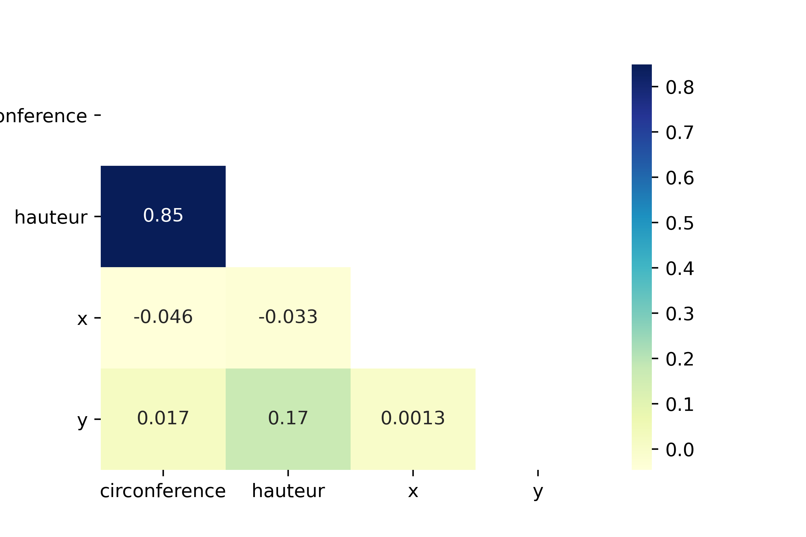

# Tree data test

This example is based on the **trees.json** dataset containing information about trees in Paris.
The dataset is downloaded from Paris Open Data Repository and we have removed some attributes.

So for each tree we have the following data :

- ***id*** tree id
- ***circonference*** circumference of the tree (cm.)
- ***hauteur*** height of the tree (m.)
- ***remarquable*** whether the tree is remarkable or not (OUI/NON)
- ***x*** coordinate x, geolocation of the tree (latitude)
- ***y*** coordinate y, geolocation of the tree (longitude)

We removed the ***id*** attribute because it is an identifier.
Consider that the ***remarquable*** attribute is a sensitive data and given the original data,

```json
{
    "circonference":20,
    "hauteur":5,
    "remarquable":"NON",
    "x":48.9002546593994,
    "y":2.334152828878867
  },
  {
    "circonference":115,
    "hauteur":10,
    "remarquable":"NON",
    "x":48.84935636396974,
    "y":2.3957233289766773
  },
```

This part is intended to show you different anonymization techniques and to show you that this does not significantly affect the correlation of attributes.

## Correlation

To calculate the correlation between each variable of the dataset we use the pearson correlation.
Pearson correlation measures the strength of the linear relationship between two continuous variables. It has a value between -1 to 1, with a value of -1 meaning a total negative linear correlation, 0 being no correlation, and + 1 meaning a total positive correlation.

Pearson Correlation Coefficient :
%20=%20%5Cfrac%7B%5Csum%20%5Cleft%20%5B%20%5Cleft%20(%20x_%7Bi%7D%20-%20%5Cbar%7Bx%7D%20%5Cright%20)%20*%20%5Cleft%20(%20y_%7Bi%7D%20-%20%5Cbar%7By%7D%20%5Cright%20)%20%20%5Cright%20%5D%7D%7B%5Csigma_%7Bx%7D%20*%20%5Csigma_%7By%7D%7D)

With,


```python
import pandas as pd
import numpy as np
import json

input_file = open(r'trees.json')
jsondata = json.load(input_file)
df = pd.DataFrame(jsondata)

df.corr(method='pearson')
```

|               | circonference |  hauteur  |     x     |     y    |
|---------------|:-------------:|:---------:|:---------:|:--------:|
| circonference |    1.000000   |  0.848523 | -0.045860 | 0.017326 |
| hauteur       |    0.848523   |  1.000000 | -0.032621 | 0.168414 |
| x             |   -0.045860   | -0.032621 |  1.000000 | 0.001270 |
| y             |    0.017326   |  0.168414 |  0.001270 | 1.000000 |

```python
import seaborn as sb

mask = np.triu(np.ones(df.corr().shape)).astype(np.bool)
plot = sb.heatmap(df.corr(), mask = mask, cmap="YlGnBu", annot=True)
```


