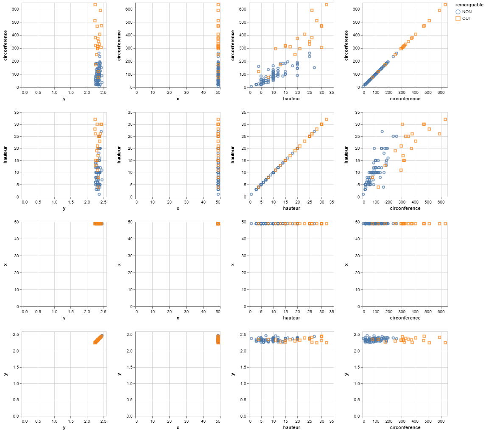
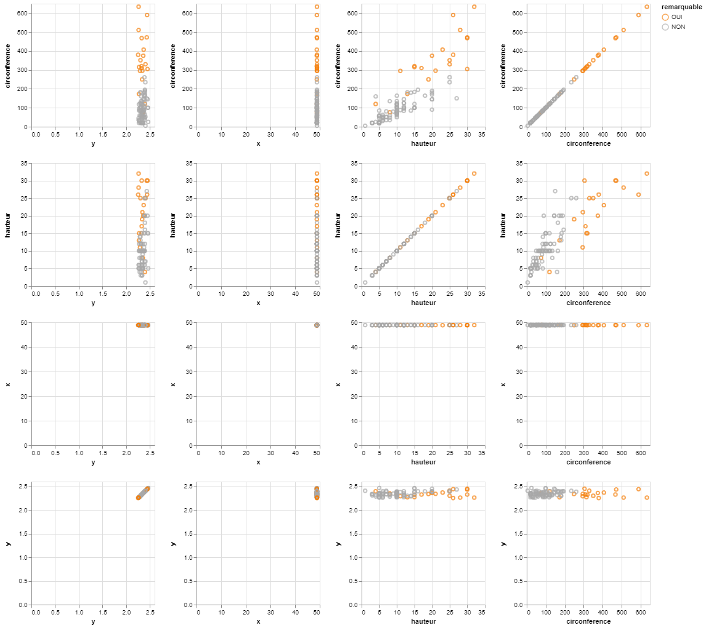

# Tree data test

This example is based on the **trees.json** dataset containing information about trees in Paris.
The dataset is downloaded from Paris Open Data Repository and we have removed some attributes.

So for each tree we have the following data :

- ***Id*** tree id
- ***circonference*** circumference of the tree (cm.)
- ***hauteur*** height of the tree (m.)
- ***remarquable*** whether the tree is remarkable or not (OUI/NON)
- ***x*** coordinate x, geolocation of the tree (latitude)
- ***y*** coordinate y, geolocation of the tree (longitude)

Consider that the ***remarquable*** attribute is a sensitive data and given the original data,



```console
< trees.json | jq -c '.[]' | sigo -q id,circonference,hauteur,x,y -s remarquable| jq -s > trees_sigo.json
```



We can see that the anonymisation of the dataset has not changed the correlation of the attributes.
