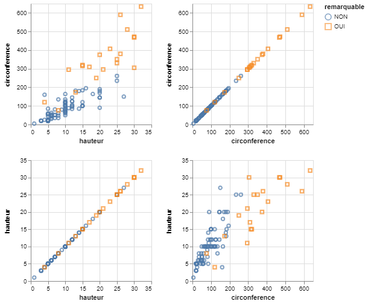
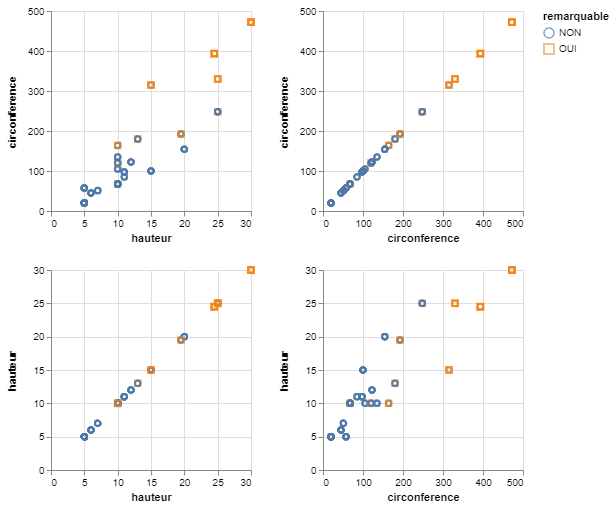
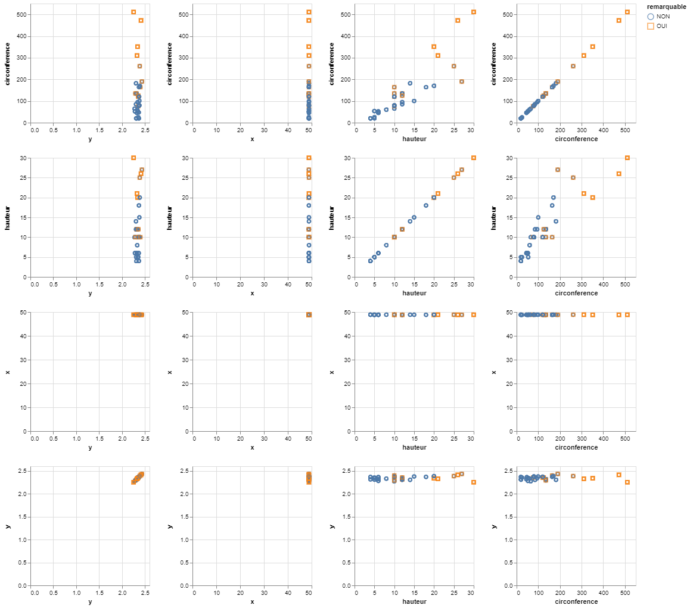

# Micro-Aggregation technique

This technique is applied to continuous data. It is made up of two steps : partitioning and aggregation.

- **Partitioning** is to form groups of at least k records called micro-aggregates.
- **Aggregation** is to group together the values of the same cluster by a central value (mean or median).

This demo is based on the **trees.json** dataset and the data is aggregated using the **median**.

## 2-dimension

This part focuses on 2 quasi-identifiers : ***circonference*** and ***hauteur***.
The sensitive data is always the attribute ***remarquable***.

The data is recorded in the trees2.json file, below you will find an overview of the data :

```json
    {
        "circonference":20,
        "hauteur":5,
        "remarquable":"NON"
    },
    {
        "circonference":115,
        "hauteur":10,
        "remarquable":"NON"
    },
    {
        "circonference":105,
        "hauteur":10,
        "remarquable":"NON"
    },
```

### 1- Original data



|               | circonference |  hauteur |
|---------------|:-------------:|:--------:|
| circonference |    1.000000   | 0.848523 |
| hauteur       |    0.848523   | 1.000000 |

### 1- De-identified data

```console
< trees2.json | jq -c '.[]' | sigo -q circonference,hauteur -s remarquable | jq -s > trees2_sigo.json
```



|               |  hauteur | circonference |
|---------------|:--------:|:-------------:|
| hauteur       | 1.000000 |    0.911786   |
| circonference | 0.911786 |    1.000000   |

## n-dimension

This part focuses on 4 quasi-identifiers : ***circonference***, ***hauteur***, ***x*** and ***y***.
The sensitive data is always the attribute ***remarquable***.

The data is recorded in the treesn.json file, below you will find an overview of the data :

```json
    {
        "circonference":20,
        "hauteur":5,
        "remarquable":"NON",
        "x":48.9002546593994,
        "y":2.334152828878867
    },
    {
        "circonference":115,
        "hauteur":10,
        "remarquable":"NON",
        "x":48.84935636396974,
        "y":2.3957233289766773
    },
```

### 2- Original data


|               | circonference |  hauteur  |     x     |     y    |
|---------------|:-------------:|:---------:|:---------:|:--------:|
| circonference |    1.000000   |  0.848523 | -0.045860 | 0.017326 |
| hauteur       |    0.848523   |  1.000000 | -0.032621 | 0.168414 |
| x             |   -0.045860   | -0.032621 |  1.000000 | 0.001270 |
| y             |    0.017326   |  0.168414 |  0.001270 | 1.000000 |

### 2- De-identified data

```console
< treesn.json | jq -c '.[]' | sigo -q circonference,hauteur,x,y -s remarquable | jq -s > treesn_sigo.json
```



|               | circonference |  hauteur  |     x     |     y    |
|---------------|:-------------:|:---------:|:---------:|:--------:|
| circonference |    1.000000   |  0.885923 | -0.094617 | 0.054231 |
| hauteur       |    0.885923   |  1.000000 | -0.109564 | 0.226506 |
| x             |   -0.094617   | -0.109564 |  1.000000 | 0.084301 |
| y             |    0.054231   |  0.226506 |  0.084301 | 1.000000 |

The correlation after anonymization is in the range 

### Bibliography

***D. Defays and P. Nanopoulos***, **"Panels of enterprises and confidentiality: The small aggregates method"**,
[in 92 Symposium on Design and Analysis of Longitudinal Surveys, Canada, Ottawa, 1993, 195–204](<https://publications.gc.ca/site/eng/9.844634/publication.html#:~:text=Symposium%2092%20%3A%20design%20and%20analysis%20of%20longitudinal,year%20the%20symposium%20focuses%20on%20a%20particular%20theme>).
