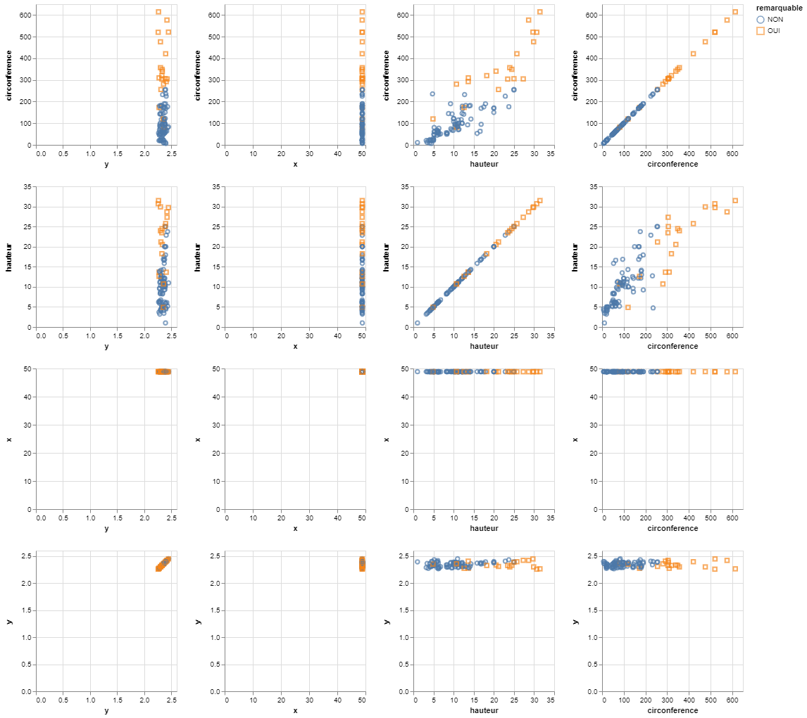

# Random Noise

It consists in adding random noise on quantitative variables.

This demo is based on the **trees.json** dataset and the added noise comes from a **Laplace** distribution.

## 2-dimension

This part focuses on 2 quasi-identifiers : ***x*** and ***y***.
The sensitive data is always the attribute ***remarquable***.

The data is recorded in the trees2.json file, below you will find an overview of the data :

```json
    {
      "remarquable":"NON",
      "x":48.9002546593994,
      "y":2.334152828878867
    },
    {
      "remarquable":"NON",
      "x":48.84935636396974,
      "y":2.3957233289766773
    },
    {
      "remarquable":"NON",
      "x":48.82684079577445,
      "y":2.293649210836102
    },
```

### 1- Original data


|   |    x    |    y    |
|---|:-------:|:-------:|
| x | 1.00000 | 0.00127 |
| y | 0.00127 | 1.00000 |

### 1- De-identified data

```console
< trees2.json | jq -c '.[]' | sigo -q x,y -s remarquable -a laplaceNoise | jq -s > trees2_sigo.json
```


|   |     x     |     y     |
|---|:---------:|:---------:|
| x |  0.000000 |  0.001138 |
| y |  0.001138 |  0.000000 |

## n-dimension

This part focuses on 4 quasi-identifiers : ***circonference***, ***hauteur***, ***x*** and ***y***.
The sensitive data is always the attribute ***remarquable***.

The data is recorded in the treesn.json file, below you will find an overview of the data :

```json
    {
        "circonference":20,
        "hauteur":5,
        "remarquable":"NON",
        "x":48.9002546593994,
        "y":2.334152828878867
    },
    {
        "circonference":115,
        "hauteur":10,
        "remarquable":"NON",
        "x":48.84935636396974,
        "y":2.3957233289766773
    },
```

### 2- Original data


|               | circonference |  hauteur  |     x     |     y    |
|---------------|:-------------:|:---------:|:---------:|:--------:|
| circonference |    1.000000   |  0.848523 | -0.045860 | 0.017326 |
| hauteur       |    0.848523   |  1.000000 | -0.032621 | 0.168414 |
| x             |   -0.045860   | -0.032621 |  1.000000 | 0.001270 |
| y             |    0.017326   |  0.168414 |  0.001270 | 1.000000 |

### 2- De-identified data

```console
< treesn.json | jq -c '.[]' | sigo -q circonference,hauteur,x,y -s remarquable -a laplaceNoise | jq -s > treesn_sigo.json
```



|               | circonference |  hauteur  |     x     |     y    |
|---------------|:-------------:|:---------:|:---------:|:--------:|
| circonference |    1.000000   |  0.865131 | -0.080272 | 0.061114 |
| hauteur       |    0.865131   |  1.000000 | -0.021962 | 0.160181 |
| x             |   -0.080272   | -0.021962 |  1.000000 |-0.020916 |
| y             |    0.061114   |  0.160181 | -0.020916 | 1.000000 |

The correlation after anonymization is in the range $\left[ \pm 0.01; \pm 0.04\right]$.

### Bibliography

***Brand, Ruth.***, **"Microdata Protection through Noise Addition"**,
[in Inference Control in Statistical Databases, From Theory to Practice, 2002, 97‑116](<https://link.springer.com/chapter/10.1007/3-540-47804-3_8?code=d7da801e-b5d7-4f86-8820-3547ba948938>).
