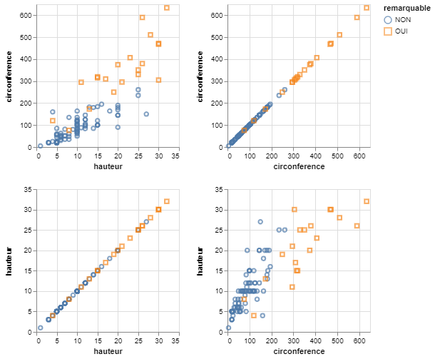
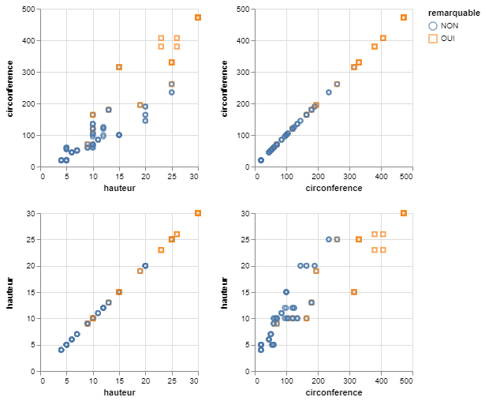
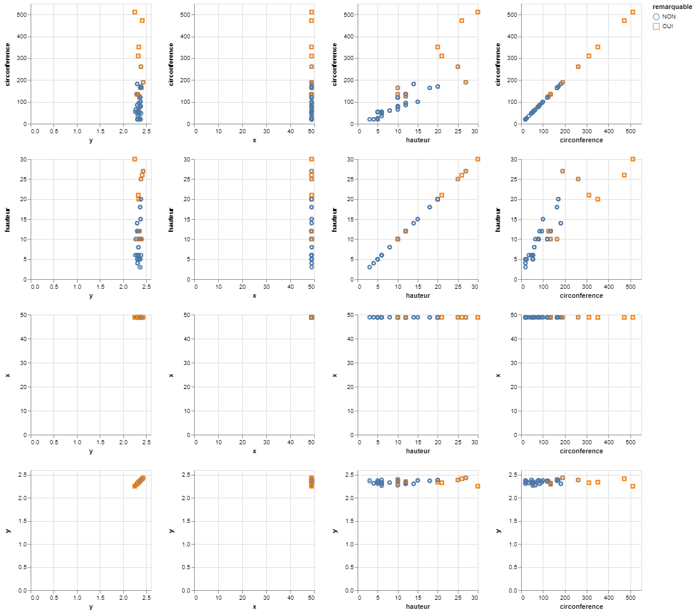

# Top Coding and Bottom Coding technique

It consists in setting top-codes or bottom-codes on quantitative variables.

- **Top Coding** for a variable is to replace by the upper limit any value greater than this limit.
- Similarly, **Bottom Coding** is to replace by the lower limit all values less than this limit.

Different limits may be used for different quantitative variables, here we use a percentage provided by the user that defines the number of upper values and the number of lower values that should be hidden.

This demo is based on the **trees.json** dataset and the hidden value percentage is ***30%***.

## 2-dimension

This part focuses on 2 quasi-identifiers : ***circonference*** and ***hauteur***.
The sensitive data is always the attribute ***remarquable***.

The data is recorded in the trees2.json file, below you will find an overview of the data :

```json
    {
        "circonference":20,
        "hauteur":5,
        "remarquable":"NON"
    },
    {
        "circonference":115,
        "hauteur":10,
        "remarquable":"NON"
    },
    {
        "circonference":105,
        "hauteur":10,
        "remarquable":"NON"
    },
```

### 1- Original data



|               | circonference |  hauteur |
|---------------|:-------------:|:--------:|
| circonference |    1.000000   | 0.848523 |
| hauteur       |    0.848523   | 1.000000 |

### 1- De-identified data

```console
< trees2.json | jq -c '.[]' | sigo -q circonference,hauteur -s remarquable | jq -s > trees2_sigo.json
```



|               |  hauteur | circonference |
|---------------|:--------:|:-------------:|
| hauteur       | 1.000000 |    0.910787   |
| circonference | 0.910787 |    1.000000   |

## n-dimension

This part focuses on 4 quasi-identifiers : ***circonference***, ***hauteur***, ***x*** and ***y***.
The sensitive data is always the attribute ***remarquable***.

The data is recorded in the treesn.json file, below you will find an overview of the data :

```json
    {
        "circonference":20,
        "hauteur":5,
        "remarquable":"NON",
        "x":48.9002546593994,
        "y":2.334152828878867
    },
    {
        "circonference":115,
        "hauteur":10,
        "remarquable":"NON",
        "x":48.84935636396974,
        "y":2.3957233289766773
    },
```

### 2- Original data


|               | circonference |  hauteur  |     x     |     y    |
|---------------|:-------------:|:---------:|:---------:|:--------:|
| circonference |    1.000000   |  0.848523 | -0.045860 | 0.017326 |
| hauteur       |    0.848523   |  1.000000 | -0.032621 | 0.168414 |
| x             |   -0.045860   | -0.032621 |  1.000000 | 0.001270 |
| y             |    0.017326   |  0.168414 |  0.001270 | 1.000000 |

### 2- De-identified data

```console
< treesn.json | jq -c '.[]' | sigo -q circonference,hauteur,x,y -s remarquable | jq -s > treesn_sigo.json
```



|               | circonference |  hauteur  |     x     |     y    |
|---------------|:-------------:|:---------:|:---------:|:--------:|
| circonference |    1.000000   |  0.885431 | -0.093876 | 0.053053 |
| hauteur       |    0.885431   |  1.000000 | -0.108861 | 0.222908 |
| x             |   -0.093876   | -0.108861 |  1.000000 | 0.077913 |
| y             |    0.053053   |  0.222908 |  0.077913 | 1.000000 |

The correlation after anonymization is in the range $$ [\pm 0.035; \pm 0.076] $$

### Bibliography

***Domingo-Ferrer, Josep, and Vicenc Torra.***, **"A quantitative comparison of disclosure control methods for microdata"**,
[in Confidentiality, disclosure and data access: theory and practical applications for statistical agencies, 2001, 111–134.](<https://www.researchgate.net/publication/33675153_Confidentiality_Disclosure_and_Data_Access_Theory_and_Practical_Applications_for_Statistical_Agencies>).

***Domingo-Ferrer, Josep, and Vicenç Torra.*** **"Distance-based and probabilistic record linkage for reidentification of records with categorical variables"**. [in Butlletí de lACIA, Associació Catalana dIntelligència Artificial, 2002.](<https://www.researchgate.net/profile/Josep-Domingo-Ferrer/publication/228807929_Distance-based_and_probabilistic_record_linkage_for_re-identification_of_records_with_categorical_variables/links/0deec5167b9f44e498000000/Distance-based-and-probabilistic-record-linkage-for-re-identification-of-records-with-categorical-variables.pdf>).
